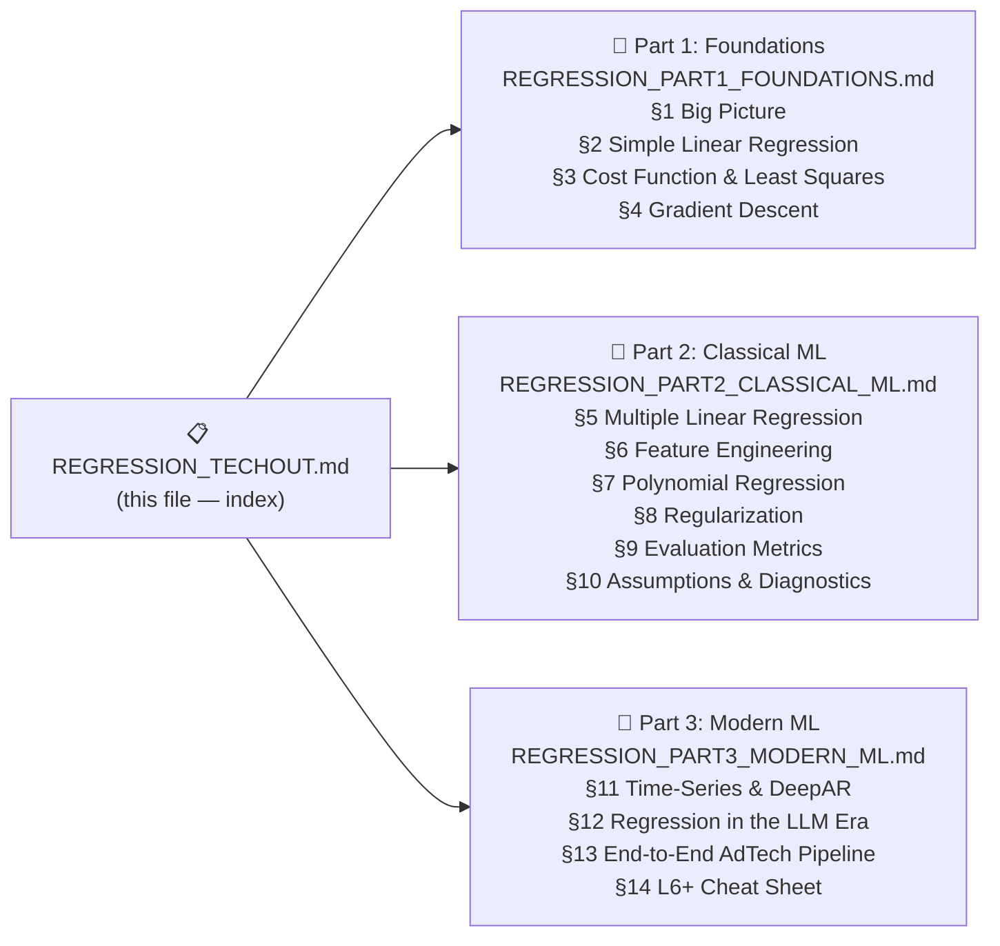

# 📊 Regression Techout — Index
### From School Math → Production ML → LLM Era
> **Audience:** L6+ AIML Engineer Preparation  
> **Stack:** Python · scikit-learn · PyTorch · statsmodels · LightGBM · HuggingFace · Chronos  
> **AdTech Focus:** All examples use Bing Ads / ad-click prediction — the production domain you'll discuss in interviews.

```bash
# Install all dependencies used across all 3 parts
pip install numpy pandas scikit-learn torch statsmodels lightgbm \
            transformers "chronos-forecasting[training]" neuralforecast \
            matplotlib seaborn shap
```

---

## 📂 Document Map



---

## 📘 [Part 1 — Foundations](docs/REGRESSION_PART1_FOUNDATIONS.md)

**What you'll learn:** The mathematical bedrock — from a school scatter plot to the gradient update that trains GPT-4.

| Section | Core Concept | AdTech Example |
|---------|-------------|----------------|
| §1 Big Picture | $\hat{y} = f(x) + \epsilon$ | Impressions → Clicks forecasting |
| §2 Simple Linear | $\hat{y} = \beta_0 + \beta_1 x$, OLS closed-form | Ad impressions → clicks slope |
| §3 Cost Function | MSE, Huber Loss, Poisson Deviance | Why we penalise large campaign misses more |
| §4 Gradient Descent | $\boldsymbol{\beta} \leftarrow \boldsymbol{\beta} - \alpha \nabla \mathcal{L}$, AdamW | Updating bid model weights on auction stream |

**Code:** `numpy` manual GD · `sklearn LinearRegression` · `torch nn.Linear` · `CosineAnnealingLR`

---

## 📗 [Part 2 — Classical ML](docs/REGRESSION_PART2_CLASSICAL_ML.md)

**What you'll learn:** Scaling to real-world ad feature sets — multiple signals, nonlinearity, regularization, statistical validation.

| Section | Core Concept | AdTech Example |
|---------|-------------|----------------|
| §5 Multiple Regression | $\hat{y} = \boldsymbol{\beta}^T \mathbf{x}$, Normal Equation $O(p^3)$ | Impressions + bid + quality_score → clicks |
| §6 Feature Engineering | One-hot, target encode, log-transform, ColumnTransformer | device_type, match_type, advertiser_id |
| §7 Polynomial | $\hat{y} = \sum \beta_j x^j$, Bias-Variance tradeoff | Quality score → CTR curve (diminishing returns) |
| §8 Regularization | Ridge, Lasso, ElasticNet, AdamW weight\_decay | Sparse keyword feature selection |
| §9 Metrics | RMSE, MAE, MAPE, R², Adj R², sMAPE | Campaign budget forecast accuracy |
| §10 Diagnostics | LINE+H assumptions, DW, VIF, residual plots | Autocorrelation in daily ad data |

**Code:** `sklearn Pipeline` · `statsmodels OLS summary` · `RidgeCV/LassoCV/ElasticNetCV` · `ColumnTransformer` · VIF / Durbin-Watson · residual plots

---

## 📕 [Part 3 — Modern ML](docs/REGRESSION_PART3_MODERN_ML.md)

**What you'll learn:** Time-series forecasting, LLM-era regression, production pipeline, and the L6 cheat sheet.

| Section | Core Concept | AdTech Example |
|---------|-------------|----------------|
| §11 Time-Series & DeepAR | AR($p$), ARIMA, DeepAR, probabilistic $P_{10}/P_{50}/P_{90}$ | Monthly ad budget forecasting across campaign portfolio |
| §12 LLM Era | In-context regression, RLHF reward model, LightGBM vs LLM | Ad copy quality scoring, Bing Copilot bid suggestions |
| §13 E2E Pipeline | Full AdTech ML lifecycle, PSI drift monitoring | `ad_click_data_train.csv` → Azure ML endpoint |
| §14 L6 Cheat Sheet | All equations, AdTech model selection tree, STAR-ML, Top 10 Q&A | Interview-ready one-liners |

**Code:** `Chronos` zero-shot · `neuralforecast DeepAR` · HuggingFace reward model · `LightGBM` + SHAP · PSI drift monitor · full E2E pipeline

---

## ⚡ Quick Reference — Core Equations

| Formula | Name |
|---------|------|
| $\boldsymbol{\beta}^* = (\mathbf{X}^T\mathbf{X})^{-1}\mathbf{X}^T\mathbf{y}$ | OLS Normal Equation |
| $\boldsymbol{\beta}^* = (\mathbf{X}^T\mathbf{X} + \lambda\mathbf{I})^{-1}\mathbf{X}^T\mathbf{y}$ | Ridge (always invertible) |
| $\boldsymbol{\beta} \leftarrow \boldsymbol{\beta} - \frac{\alpha}{n}\mathbf{X}^T(\mathbf{X}\boldsymbol{\beta} - \mathbf{y})$ | Gradient descent update |
| $\mathbb{E}[(\hat{y}-y)^2] = \text{Bias}^2 + \text{Variance} + \sigma^2$ | Bias-Variance decomposition |
| $R^2 = 1 - SS_{res}/SS_{tot}$ | Coefficient of determination |
| $\theta \leftarrow \theta - \alpha\hat{m}/(\sqrt{\hat{v}}+\epsilon) - \alpha\lambda\theta$ | AdamW update |
| $\mathcal{L} = -\log\sigma(r_{chosen} - r_{rejected})$ | RLHF reward model loss |
| $\text{PSI} = \sum(P_{act}-P_{exp})\ln(P_{act}/P_{exp}) > 0.2$ | Production drift alert |

---

## 🏗️ Project Java Code (Reference Implementation)

The original Java code in `src/main/java/` provides the same concepts in Apache Commons Math / DJL:

| Java Class | Python Equivalent in Techout |
|------------|------------------------------|
| `AdClickLinearRegression.java` | Part 1 §2 — `sklearn LinearRegression` on impressions → clicks |
| `CovidCaseLinearRegression.java` | Part 1 §2 — `torch nn.Linear` gradient descent |
| `CovidCaseLinearRegressionSpark.java` | Part 2 §5 — distributed equivalent: PySpark MLlib |
| `AirPassengersDeepAR.java` | Part 3 §11 — `neuralforecast DeepAR` + `Chronos` |

---

## Claude Instructions → [CLAUDE_INSTRUCTIONS.md](CLAUDE_INSTRUCTIONS.md)

Use this system prompt when asking Claude to add new sections, extend examples, or generate practice problems.

````
