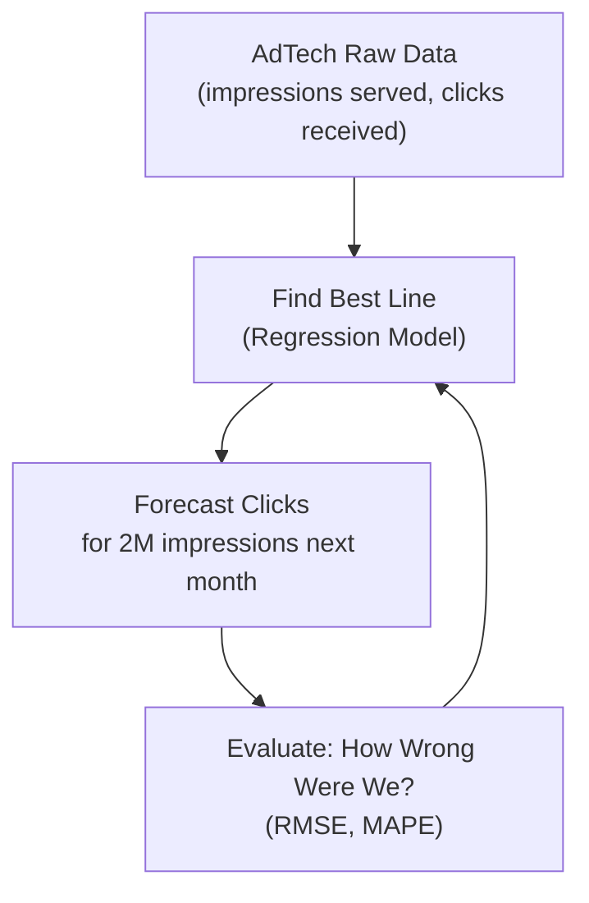
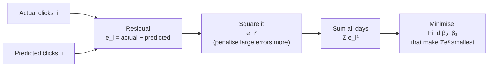
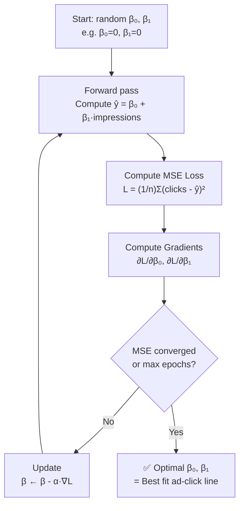
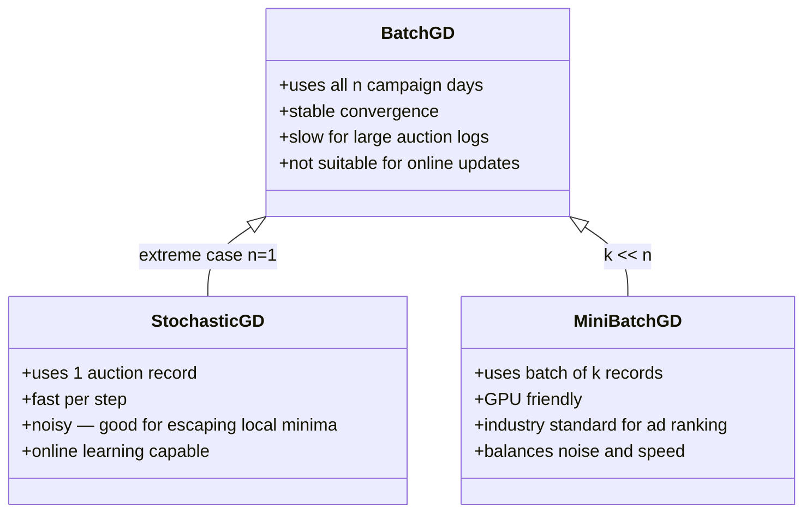

# 📊 Regression Techout — Part 1: Foundations
### School Math → OLS → Gradient Descent
> **Part of:** [Index](../REGRESSION_TECHOUT.md) · Part 1 · [Part 2](REGRESSION_PART2_CLASSICAL_ML.md) · [Part 3](REGRESSION_PART3_MODERN_ML.md)  
> **Audience:** L6+ AIML Engineer Preparation  
> **AdTech Context:** Every example anchors to Bing Ads / ad-click prediction — the domain you'll discuss in interviews.

```bash
pip install numpy pandas scikit-learn torch statsmodels matplotlib seaborn
```

---

## Table of Contents — Part 1

1. [The Big Picture — What is Regression?](#1-the-big-picture)
2. [Simple Linear Regression](#2-simple-linear-regression)
3. [Cost Function & Least Squares](#3-cost-function--least-squares)
4. [Gradient Descent](#4-gradient-descent)

---

## 1. The Big Picture

### 🏫 School Intuition

You sell ad space on Bing. You notice: the more **ad impressions** you serve, the more **clicks** advertisers get.  
Regression is just drawing the **best straight line** through those (impressions, clicks) points so you can **forecast** future clicks from a planned impression budget.



### 📐 Math Formulation

Regression solves: *given input* $x$, *predict output* $\hat{y}$.

$$
\hat{y} = f(x) + \epsilon
$$

Where:
- $\hat{y}$ = predicted output (e.g., predicted clicks)
- $f(x)$ = the model function (line, curve, neural net…)
- $\epsilon$ = irreducible noise (user behaviour variance, day-of-week effects)

### 🤖 LLM / Modern ML Connection

In LLMs, the **final linear projection layer** (`lm_head`) is *regression* — it maps a hidden vector $\mathbf{h} \in \mathbb{R}^d$ to logit scores $\mathbf{z} \in \mathbb{R}^{|V|}$ over vocabulary size $|V|$.

$$
\mathbf{z} = \mathbf{W}_{lm} \mathbf{h} + \mathbf{b}
$$

Every attention score, every MLP layer weight — all learned via regression-style gradient updates.

---

## 2. Simple Linear Regression

### 🏫 School Intuition

The simplest prediction: **one input → one output**.  
*"For every extra 1,000 ad impressions served on Bing, how many additional clicks do we get?"*  
That's exactly the `AdClickLinearRegression.java` problem — one slope, one intercept.

### 📐 Math Formulation

$$
\hat{y} = \beta_0 + \beta_1 x
$$

Where:
- $x$ = ad impressions
- $\hat{y}$ = predicted clicks
- $\beta_0$ = **intercept** (baseline clicks even with 0 impressions — brand-direct traffic)
- $\beta_1$ = **slope** (incremental clicks per additional impression)

**Closed-form solution (Ordinary Least Squares):**

$$
\beta_1 = \frac{\sum_{i=1}^{n}(x_i - \bar{x})(y_i - \bar{y})}{\sum_{i=1}^{n}(x_i - \bar{x})^2}
$$

$$
\beta_0 = \bar{y} - \beta_1 \bar{x}
$$

Where $\bar{x}$ and $\bar{y}$ are the sample means.

### 🔁 Worked Example — Ad Click Data

| Day ($i$) | Impressions $x$ (000s) | Clicks $y$ |
|-----------|------------------------|-----------|
| 1 | 10 | 85 |
| 2 | 14 | 102 |
| 3 | 12 | 97 |
| 4 | 16 | 110 |
| 5 | 11 | 89 |

**Step 1:** $\bar{x} = 12.6$, $\bar{y} = 96.6$

**Step 2:** Slope

$$
\beta_1 = \frac{(10-12.6)(85-96.6)+\cdots+(11-12.6)(89-96.6)}{(10-12.6)^2+\cdots+(11-12.6)^2}
= \frac{99.4}{26.8} \approx 3.71
$$

**Step 3:** Intercept

$$
\beta_0 = 96.6 - 3.71 \times 12.6 \approx 49.8
$$

**Step 4:** Model — $\hat{\text{clicks}} = 49.8 + 3.71 \times \text{impressions}_{000s}$  
Predict for 15k impressions: $\hat{y} = 49.8 + 3.71 \times 15 = 105.4$ clicks

### 🧑‍💻 Python — scikit-learn (classical, production-ready)

```python
import numpy as np
from sklearn.linear_model import LinearRegression
import matplotlib.pyplot as plt

# Ad impressions (000s) → clicks  [from ad_click_data_train.csv]
X = np.array([[10],[14],[12],[16],[11]], dtype=float)   # impressions (000s)
y = np.array([85, 102, 97, 110, 89],   dtype=float)    # clicks

model = LinearRegression()
model.fit(X, y)

print(f"β₁ (clicks per 1k impressions) = {model.coef_[0]:.4f}")
print(f"β₀ (baseline clicks)           = {model.intercept_:.4f}")
print(f"Forecast at 15k impressions    = {model.predict([[15]])[0]:.1f} clicks")
print(f"R²                             = {model.score(X, y):.4f}")

# Visualise the regression line
x_range = np.linspace(9, 18, 100).reshape(-1, 1)
plt.scatter(X, y, color="steelblue", label="Actual clicks", zorder=5)
plt.plot(x_range, model.predict(x_range), color="tomato", label="OLS fit")
plt.xlabel("Impressions (000s)"); plt.ylabel("Clicks")
plt.title("Bing Ads: Impressions → Clicks (Simple Linear Regression)")
plt.legend(); plt.tight_layout(); plt.savefig("simple_regression.png", dpi=150)
```

### 🧑‍💻 Python — PyTorch (regression as a 1-layer neural net)

```python
import torch
import torch.nn as nn

# Same ad data as a PyTorch tensor
X = torch.tensor([[10.],[14.],[12.],[16.],[11.]])
y = torch.tensor([[85.],[102.],[97.],[110.],[89.]])

# nn.Linear(1,1) IS simple linear regression: ŷ = w·x + b
model     = nn.Linear(in_features=1, out_features=1)
optimizer = torch.optim.SGD(model.parameters(), lr=0.001)
loss_fn   = nn.MSELoss()

for epoch in range(3000):
    pred = model(X)
    loss = loss_fn(pred, y)
    optimizer.zero_grad()
    loss.backward()      # autograd computes ∂L/∂w and ∂L/∂b
    optimizer.step()

print(f"β₁ = {model.weight.item():.4f}")   # ≈ 3.71
print(f"β₀ = {model.bias.item():.4f}")     # ≈ 49.8
print(f"MSE loss = {loss.item():.4f}")
```

> **Why both?** scikit-learn for fast deployment; PyTorch to understand that `loss.backward()` + `optimizer.step()` is the **same gradient update** used to train GPT-4 — the math is identical at every scale.

### 🤖 LLM / Modern ML Connection

Simple linear regression **is** a 1-layer neural network with **no activation** and **MSE loss**. The slope $\beta_1$ is the single weight $w$; the intercept $\beta_0$ is the bias $b$.  

In **Bing Ads ranking**, every advertiser's bid-adjustment model starts from exactly this — a linear score function.

### 💼 L6+ Interview Angle

> **"When would you prefer OLS closed-form over gradient descent for an ad forecasting model?"**  
> - OLS closed-form: exact solution in $O(p^3)$ — use when $p$ (number of features) is small (< 10k) and dataset fits in memory.  
> - Gradient descent: preferred when $n$ and $p$ are both huge (billions of ad auction records, millions of keyword features).  
> - At Bing Ads scale: gradient descent with mini-batches + AdamW is the production default.  
> - The Normal Equation $(\mathbf{X}^T\mathbf{X})^{-1}\mathbf{X}^T\mathbf{y}$ becomes numerically unstable with high-dimensional sparse features — use regularized variants (Ridge) or iterative solvers (LBFGS).

### ⚠️ Common Pitfalls

- [ ] Forgetting to check **linearity assumption** before applying OLS — plot impressions vs clicks first
- [ ] Using simple regression when multiple ad signals matter (CTR, quality score, bid) → use multiple regression
- [ ] Not **scaling features** before comparing slopes across different units (impressions vs bid price in dollars)
- [ ] Ad click data has **heteroscedasticity** — variance grows with impressions; log-transform $y$ or use WLS

---

## 3. Cost Function & Least Squares

### 🏫 School Intuition

You drew a regression line through the ad click scatter plot. Some campaign days are above the line (more clicks than predicted — a good day), some below.  
The **residual** for each day = actual clicks − predicted clicks.  
We want to minimize the total error. But positive and negative residuals cancel out, so we **square them** first.  
**Least Squares** = find the line that minimizes the sum of squared residuals.

### 📐 Math Formulation

**Residual** for campaign day $i$:

$$
e_i = y_i - \hat{y}_i = \text{actual\_clicks}_i - \hat{\text{clicks}}_i
$$

**Mean Squared Error (MSE) — the cost function:**

$$
\mathcal{L}(\beta_0, \beta_1) = \frac{1}{n} \sum_{i=1}^{n} (y_i - \hat{y}_i)^2 = \frac{1}{n} \sum_{i=1}^{n} (\text{clicks}_i - \beta_0 - \beta_1 \cdot \text{impressions}_i)^2
$$

**Probabilistic view** — minimizing MSE is equivalent to maximum likelihood under Gaussian noise:

$$
\text{clicks}_i = \beta_0 + \beta_1 \cdot \text{impressions}_i + \epsilon_i, \quad \epsilon_i \sim \mathcal{N}(0, \sigma^2)
$$



### 🔁 Worked Example — Residual Table

Using $\hat{y} = 49.8 + 3.71x$ from our ad-click model:

| Day | Impressions $x$ | Actual $y$ | Predicted $\hat{y}$ | Residual $e_i$ | $e_i^2$ |
|-----|----------------|-----------|---------------------|----------------|---------|
| 1 | 10 | 85 | 86.9 | −1.9 | 3.6 |
| 2 | 14 | 102 | 101.7 | +0.3 | 0.1 |
| 3 | 12 | 97 | 94.3 | +2.7 | 7.3 |
| 4 | 16 | 110 | 109.1 | +0.9 | 0.8 |
| 5 | 11 | 89 | 90.6 | −1.6 | 2.6 |

$$\text{MSE} = \frac{3.6+0.1+7.3+0.8+2.6}{5} = \frac{14.4}{5} = 2.88 \quad \Rightarrow \quad \text{RMSE} = \sqrt{2.88} \approx 1.7 \text{ clicks}$$

### 🧑‍💻 Python — MSE, Huber Loss, and Poisson Deviance for Click Data

```python
import numpy as np
import torch
import torch.nn as nn
from sklearn.metrics import mean_squared_error, d2_tweedie_score

y_actual    = np.array([85., 102., 97., 110., 89.])
y_predicted = np.array([86.9, 101.7, 94.3, 109.1, 90.6])

# Standard MSE / RMSE
mse  = mean_squared_error(y_actual, y_predicted)
rmse = np.sqrt(mse)
print(f"MSE  = {mse:.2f}")
print(f"RMSE = {rmse:.2f} clicks")

# Huber Loss — robust to big outlier days (viral campaigns, events)
yt = torch.tensor(y_actual,    dtype=torch.float32)
yp = torch.tensor(y_predicted, dtype=torch.float32)
huber = nn.HuberLoss(delta=5.0)   # acts like MSE within ±5 clicks, MAE beyond
print(f"Huber Loss = {huber(yp, yt).item():.4f}")

# Poisson Deviance — BETTER for count data like ad clicks (non-negative integers)
# d² Tweedie with power=1 == Poisson deviance
poisson_dev = 1 - d2_tweedie_score(y_actual, y_predicted, power=1)
print(f"Poisson Deviance = {poisson_dev:.4f}")
# Use this when clicks are low-count (long-tail campaigns, niche keywords)
```

> **AdTech note:** Ad clicks are **count data** (non-negative integers). For high-volume campaigns MSE works fine. For long-tail keywords with 0–5 clicks/day, **Poisson regression** (log-link GLM) or Negative Binomial loss is more statistically appropriate.

### 🤖 LLM / Modern ML Connection

LLMs use **Cross-Entropy Loss** for next-token prediction, but the principle is identical — measure how wrong the model is, then minimize:

$$
\mathcal{L}_{CE} = -\sum_{i} y_i \log(\hat{p}_i)
$$

For **regression tasks in LLMs** (ad quality score prediction, reward modelling), MSE loss is applied directly to the scalar output of the final linear layer.

### 💼 L6+ Interview Angle

> **"Why squared error and not absolute error for ad click forecasting?"**  
> - MSE is **differentiable everywhere** → clean gradient signal for backprop.  
> - MAE has a kink at 0 → non-differentiable, requires subgradients.  
> - MSE **penalises large errors more** (quadratic) — a 50k-click miss is penalised 100× a 5k miss. Critical when large campaigns drive disproportionate revenue.  
> - **Huber Loss** = MSE for small errors + MAE for large errors → robust to extreme campaign spikes (Super Bowl ads, product launches). This is Azure AutoML's default for regression.  
> - For **Bing Ads CTR** (0–1 range): Binary Cross-Entropy or Logloss, not MSE.

### ⚠️ Common Pitfalls

- [ ] Comparing MSE across campaigns with different volume (a campaign with 1M impressions vs 1k) — use MAPE or relative metrics
- [ ] Forgetting MSE assumes **homoscedastic** (constant) noise — ad clicks fan out with scale (heteroscedastic)
- [ ] Using MSE for count data (clicks = integers) — Poisson deviance is theoretically better for sparse keyword campaigns

---

## 4. Gradient Descent

### 🏫 School Intuition

You want to find $\beta_0$ and $\beta_1$ that make the ad-click MSE as small as possible.  
Imagine the MSE surface as a **bowl** — $\beta_0$ on one axis, $\beta_1$ on another, MSE as height.  
You start at a random point on the bowl's rim. At each step, you **look downhill and take one step in that direction**.  
Repeat until you reach the bottom (minimum MSE). That's gradient descent.



### 📐 Math Formulation

**Gradients of MSE for ad-click regression** ($x$ = impressions, $y$ = clicks):

$$
\frac{\partial \mathcal{L}}{\partial \beta_1} = -\frac{2}{n} \sum_{i=1}^{n} x_i (y_i - \hat{y}_i)
\quad \text{(slope gradient)}
$$

$$
\frac{\partial \mathcal{L}}{\partial \beta_0} = -\frac{2}{n} \sum_{i=1}^{n} (y_i - \hat{y}_i)
\quad \text{(intercept gradient)}
$$

**Update rule** with learning rate $\alpha$:

$$
\beta_1 \leftarrow \beta_1 - \alpha \cdot \frac{\partial \mathcal{L}}{\partial \beta_1}, \qquad \beta_0 \leftarrow \beta_0 - \alpha \cdot \frac{\partial \mathcal{L}}{\partial \beta_0}
$$

**Vectorized form** (scales to all features at once):

$$
\boldsymbol{\beta} \leftarrow \boldsymbol{\beta} - \frac{\alpha}{n} \mathbf{X}^T (\mathbf{X}\boldsymbol{\beta} - \mathbf{y})
$$

Where $\mathbf{X} \in \mathbb{R}^{n \times p}$, $\mathbf{y} \in \mathbb{R}^n$, $\boldsymbol{\beta} \in \mathbb{R}^p$.

### 🔁 Worked Example — First Iteration

Start: $\beta_0 = 0,\ \beta_1 = 0$, $\alpha = 0.001$, using first 2 ad-click data points $\{(10, 85),\ (14, 102)\}$:

**Forward pass:** $\hat{y}_1 = 0,\ \hat{y}_2 = 0$

$$
\frac{\partial \mathcal{L}}{\partial \beta_1} = -\frac{2}{2}[10(85-0) + 14(102-0)] = -(850 + 1428) = -2278
$$

$$
\frac{\partial \mathcal{L}}{\partial \beta_0} = -\frac{2}{2}[(85-0)+(102-0)] = -187
$$

$$
\beta_1 \leftarrow 0 - 0.001 \times (-2278) = 2.278
$$

$$
\beta_0 \leftarrow 0 - 0.001 \times (-187) = 0.187
$$

After thousands of iterations → converges to $\beta_1 \approx 3.71,\ \beta_0 \approx 49.8$.

### Gradient Descent Variants



### 🧑‍💻 Python — Manual NumPy GD (zero magic, full transparency)

```python
import numpy as np

# Ad-click data: impressions (000s) → clicks
X = np.array([10., 14., 12., 16., 11.])  # impressions
y = np.array([85., 102., 97., 110., 89.]) # clicks
n = len(X)

beta0, beta1 = 0.0, 0.0
alpha = 0.001  # learning rate

for epoch in range(5000):
    y_hat  = beta0 + beta1 * X      # forward pass
    error  = y_hat - y              # residuals

    d_b0   = (2/n) * error.sum()
    d_b1   = (2/n) * (error * X).sum()

    beta0 -= alpha * d_b0
    beta1 -= alpha * d_b1

    if epoch % 1000 == 0:
        mse = (error**2).mean()
        print(f"epoch {epoch:5d} | β₀={beta0:.3f}  β₁={beta1:.4f}  MSE={mse:.4f}")

print(f"\nFinal: β₁={beta1:.4f}  β₀={beta0:.4f}")
print(f"Forecast 15k impressions: {beta0 + beta1*15:.1f} clicks")
```

### 🧑‍💻 Python — PyTorch Adam + LR Scheduler (production pattern)

```python
import torch, torch.nn as nn, pandas as pd
import matplotlib.pyplot as plt

# Simulate loading ad_click_data_train.csv
X = torch.tensor([[10.],[14.],[12.],[16.],[11.]])
y = torch.tensor([[85.],[102.],[97.],[110.],[89.]])

# Normalize impressions — critical when mixing features of different scales
X_norm = (X - X.mean()) / X.std()

model     = nn.Linear(1, 1)
# AdamW: Adam + decoupled weight decay — standard for all Microsoft ML training
optimizer = torch.optim.AdamW(model.parameters(), lr=0.1, weight_decay=1e-4)
# Cosine annealing: LR decays smoothly — same schedule used for LLM fine-tuning
scheduler = torch.optim.lr_scheduler.CosineAnnealingLR(optimizer, T_max=1000)
loss_fn   = nn.MSELoss()

losses = []
for epoch in range(1000):
    loss = loss_fn(model(X_norm), y)
    optimizer.zero_grad()
    loss.backward()   # ← same call used in GPT-4 training, just 175B params instead of 2
    optimizer.step()
    scheduler.step()
    losses.append(loss.item())

plt.plot(losses); plt.xlabel("Epoch"); plt.ylabel("MSE")
plt.title("Ad Click Model — Loss Curve"); plt.yscale("log")
plt.tight_layout(); plt.savefig("loss_curve.png", dpi=150)
print(f"Final MSE = {losses[-1]:.4f}")
```

> **Key insight:** `loss.backward()` computes $\frac{\partial \mathcal{L}}{\partial \boldsymbol{\beta}}$ automatically via the chain rule — for 2 parameters here, and for 175 billion parameters in GPT-4. The math is identical.

### 🤖 LLM / Modern ML Connection

Every LLM is trained with **AdamW** — an adaptive gradient descent variant:

$$
m_t = \beta_1 m_{t-1} + (1-\beta_1) g_t \quad \text{(exponential moving avg of gradient)}
$$

$$
v_t = \beta_2 v_{t-1} + (1-\beta_2) g_t^2 \quad \text{(exponential moving avg of squared gradient)}
$$

$$
\theta_{t+1} = \theta_t - \frac{\alpha}{\sqrt{\hat{v}_t} + \epsilon} \hat{m}_t - \alpha \lambda \theta_t
$$

The core principle: **move parameters in the direction that reduces loss**.

### 💼 L6+ Interview Angle

> **"How do you choose learning rate for a Bing Ads CTR model trained on billions of auction records?"**  
> - **Warmup + cosine decay**: start small (1e-6), ramp to peak (1e-3) over first 5% of steps, then decay — prevents early instability in sparse feature embeddings.  
> - **AdamW is self-adapting**: per-parameter LR based on gradient history — safer for sparse ad features (keyword IDs where most gradients are zero).  
> - Too high → loss explodes or oscillates; too low → training takes weeks.  
> - In **distributed training** (Azure DeepSpeed, FSDP): effective batch size increases with number of GPUs → scale LR by $\alpha_{new} = \alpha_{base} \times \sqrt{k}$ (square-root rule).  
> - **Gradient clipping** (`max_norm=1.0`) is mandatory for LLM training — prevents gradient explosion through attention layers.

### ⚠️ Common Pitfalls

- [ ] Not normalizing features → impression counts (millions) and bid prices (dollars) have vastly different gradient scales → learning rate becomes impossible to tune
- [ ] Using a fixed LR without a scheduler → loss plateaus early
- [ ] Checking convergence only on training loss — always monitor **held-out campaign set** to detect overfitting
- [ ] Forgetting `optimizer.zero_grad()` in PyTorch → gradients accumulate across batches → wrong updates

---

## Navigation

| | |
|---|---|
| ← Previous | — |
| **You are here** | **Part 1: Foundations (§1–4)** |
| → Next | [Part 2: Classical ML — Multiple Regression, Regularization, Metrics](REGRESSION_PART2_CLASSICAL_ML.md) |
| 🗺 Index | [REGRESSION_TECHOUT.md](../REGRESSION_TECHOUT.md) |

