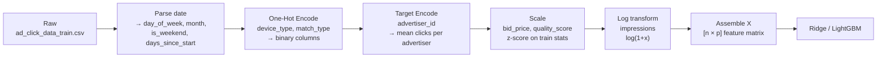
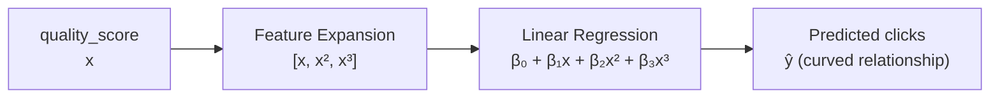
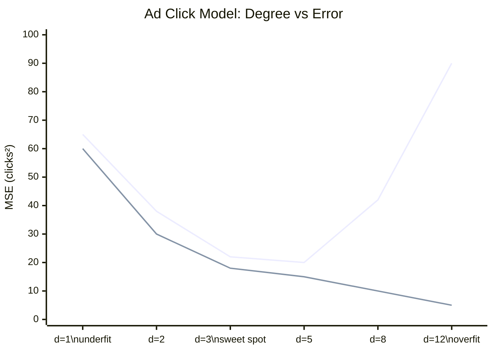
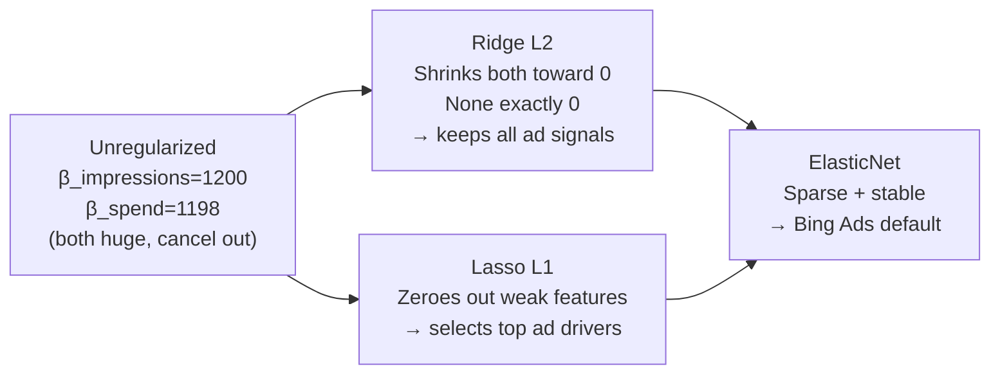
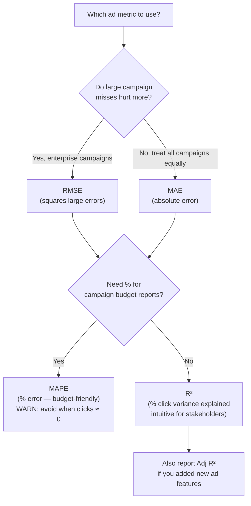
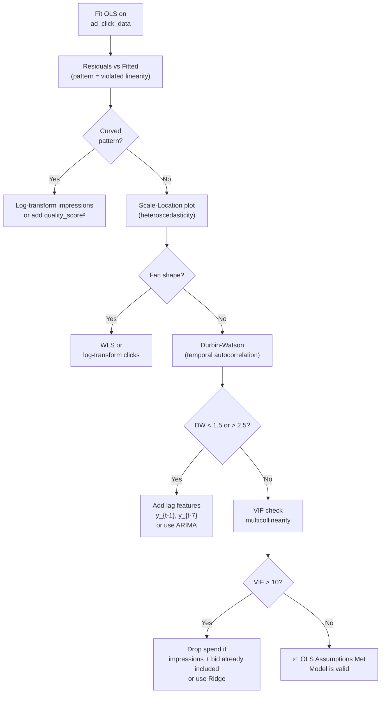

upda# 📊 Regression Techout — Part 2: Classical ML
### Multiple Regression · Feature Engineering · Polynomial · Regularization · Metrics · Diagnostics
> **Part of:** [Index](../REGRESSION_TECHOUT.md) · [Part 1](REGRESSION_PART1_FOUNDATIONS.md) · Part 2 · [Part 3](REGRESSION_PART3_MODERN_ML.md)  
> **Audience:** L6+ AIML Engineer Preparation  
> **AdTech Context:** All examples use Bing Ads signals — impressions, CTR, bid price, quality score, day-of-week.

```bash
pip install numpy pandas scikit-learn statsmodels matplotlib seaborn torch lightgbm
```

---

## Table of Contents — Part 2

5. [Multiple Linear Regression](#5-multiple-linear-regression)
6. [Feature Engineering & Encoding](#6-feature-engineering--encoding)
7. [Polynomial Regression](#7-polynomial-regression)
8. [Regularization — Ridge, Lasso, ElasticNet](#8-regularization)
9. [Evaluation Metrics](#9-evaluation-metrics)
10. [Assumptions & Diagnostics](#10-assumptions--diagnostics)

---

## 5. Multiple Linear Regression

### 🏫 School Intuition

One input (impressions) was too simple. Real ad click prediction depends on **many signals**:  
impressions + bid\_price + quality\_score + day\_of\_week + season → predicted clicks.  
Each signal gets its own "weight" (slope). We're now fitting a **hyperplane** through multi-dimensional space instead of a line through 2D space.

### 📐 Math Formulation

$$
\hat{y} = \beta_0 + \beta_1 x_1 + \beta_2 x_2 + \cdots + \beta_p x_p = \boldsymbol{\beta}^T \mathbf{x}
$$

**AdTech interpretation of each $\beta$:**
- $\beta_1$ = incremental clicks per 1k impressions (holding all else constant)
- $\beta_2$ = incremental clicks per $1 higher bid (holding all else constant)
- $\beta_3$ = incremental clicks per quality score point

**Matrix form** (all $n$ campaign-days at once):

$$
\hat{\mathbf{y}} = \mathbf{X} \boldsymbol{\beta}
$$

Where $\mathbf{X} \in \mathbb{R}^{n \times (p+1)}$ (first column = 1s for intercept).

**OLS Normal Equation:**

$$
\boldsymbol{\beta}^* = (\mathbf{X}^T \mathbf{X})^{-1} \mathbf{X}^T \mathbf{y}
$$

> ⚠️ $(\mathbf{X}^T \mathbf{X})$ must be **invertible** — fails if features are linearly dependent (e.g., including both `ctr` and `clicks/impressions` which are the same thing).

### 🔁 Worked Example — Bing Ads Multi-Feature

| Day | Impressions $x_1$ (000s) | Bid $x_2$ ($) | Quality Score $x_3$ | Clicks $y$ |
|-----|--------------------------|---------------|---------------------|-----------|
| 1 | 10 | 1.20 | 7 | 85 |
| 2 | 14 | 1.50 | 8 | 102 |
| 3 | 12 | 1.10 | 6 | 97 |
| 4 | 16 | 1.80 | 9 | 110 |
| 5 | 11 | 1.30 | 7 | 89 |

Fitted model (from statsmodels): $\hat{y} = 12.1 + 3.4 x_1 + 6.2 x_2 + 2.8 x_3$

Predict: 13k impressions, $1.40 bid, quality score 8:  
$\hat{y} = 12.1 + 3.4(13) + 6.2(1.40) + 2.8(8) = 12.1 + 44.2 + 8.68 + 22.4 = 87.4$ clicks

### 🧑‍💻 Python — scikit-learn (fast, production default)

```python
import numpy as np
from sklearn.linear_model import LinearRegression
from sklearn.preprocessing import StandardScaler
from sklearn.pipeline import Pipeline

# Bing Ads features: [impressions(000s), bid_price($), quality_score]
X = np.array([
    [10, 1.20, 7],
    [14, 1.50, 8],
    [12, 1.10, 6],
    [16, 1.80, 9],
    [11, 1.30, 7],
], dtype=float)
y = np.array([85, 102, 97, 110, 89], dtype=float)

pipe = Pipeline([
    ("scaler", StandardScaler()),   # always scale — bid price & impressions in very different units
    ("ols",    LinearRegression()),
])
pipe.fit(X, y)

coef = pipe.named_steps["ols"].coef_
b0   = pipe.named_steps["ols"].intercept_
print(f"β₀ = {b0:.2f}")
print(f"β_impressions   = {coef[0]:.4f}  (clicks per 1k impressions, scaled)")
print(f"β_bid           = {coef[1]:.4f}  (clicks per $1 bid increase, scaled)")
print(f"β_quality_score = {coef[2]:.4f}  (clicks per quality score point, scaled)")
print(f"R² = {pipe.score(X, y):.4f}")

# Predict for new campaign
new_campaign = np.array([[13, 1.40, 8]])
print(f"Forecast: {pipe.predict(new_campaign)[0]:.1f} clicks")
```

### 🧑‍💻 Python — statsmodels (statistical inference: p-values, confidence intervals)

```python
import numpy as np
import statsmodels.api as sm

X = np.array([[10,1.20,7],[14,1.50,8],[12,1.10,6],[16,1.80,9],[11,1.30,7]], dtype=float)
y = np.array([85, 102, 97, 110, 89], dtype=float)

X_const = sm.add_constant(X)   # adds β₀ intercept column
result  = sm.OLS(y, X_const).fit()

print(result.summary())
# Key outputs to read:
#   coef       → the β values
#   P>|t|      → p-value (< 0.05 = statistically significant driver of clicks)
#   [0.025 0.975] → 95% confidence interval for each coefficient
#   R-squared  → fraction of click variance explained
```

### 🧑‍💻 Python — PyTorch (multi-feature mini-batch, scalable to millions of campaigns)

```python
import torch, torch.nn as nn
from torch.utils.data import TensorDataset, DataLoader

X = torch.tensor([[10,1.20,7],[14,1.50,8],[12,1.10,6],[16,1.80,9],[11,1.30,7]],
                  dtype=torch.float32)
y = torch.tensor([85,102,97,110,89], dtype=torch.float32).unsqueeze(1)

# Z-score normalize each feature column independently
X = (X - X.mean(0)) / X.std(0)

# DataLoader: simulates mini-batch training on large auction logs
loader = DataLoader(TensorDataset(X, y), batch_size=3, shuffle=True)

model     = nn.Linear(3, 1)   # 3 ad features → 1 click prediction
optimizer = torch.optim.AdamW(model.parameters(), lr=1e-2, weight_decay=1e-4)
loss_fn   = nn.MSELoss()

for epoch in range(500):
    for Xb, yb in loader:
        optimizer.zero_grad()
        loss_fn(model(Xb), yb).backward()
        optimizer.step()

print(f"Weights (scaled): {model.weight.data}")
print(f"Bias:             {model.bias.data}")
```

### 🤖 LLM / Modern ML Connection

A **Transformer's FFN (Feed-Forward Network) block** is multiple regression + nonlinearity:

$$
\text{FFN}(\mathbf{x}) = \text{ReLU}(\mathbf{W}_1 \mathbf{x} + \mathbf{b}_1) \mathbf{W}_2 + \mathbf{b}_2
$$

Strip out ReLU → pure multiple regression. The weight matrices $\mathbf{W}_1, \mathbf{W}_2$ are the $\boldsymbol{\beta}$ matrices, learned via gradient descent.

### 💼 L6+ Interview Angle

> **"The Normal Equation is $O(p^3)$. At what scale does it break for Bing Ads?"**  
> - Bing Ads CTR models use millions of sparse features: advertiser ID embeddings, keyword IDs, query-ad pair hashes.  
> - $p > 10^5$: Normal Equation is infeasible — $10^{15}$ floating point operations to invert $\mathbf{X}^T\mathbf{X}$.  
> - **Solution**: Mini-batch SGD (online learning, handles streaming auction data), or L-BFGS for medium scale.  
> - Distributed: **PySpark MLlib's LinearRegression** uses QR decomposition (numerically stable, works on cluster).  
> - L6 expectation: know the computational complexity and the right tool at each scale.

### ⚠️ Common Pitfalls

- [ ] **Multicollinearity**: including both `impressions` and `spend` (spend ≈ impressions × bid) inflates coefficient variance — detect with VIF > 10
- [ ] **Curse of dimensionality**: adding too many ad signals without enough campaign-days → overfit
- [ ] Forgetting to add intercept column (column of 1s) in manual `np.linalg.lstsq` implementations

---

## 6. Feature Engineering & Encoding

### 🏫 School Intuition

Our ad click model speaks **numbers**. But ad data has:
- **Categories**: day-of-week (Monday… Sunday), device type (mobile/desktop/tablet), match type (exact/broad/phrase)
- **Text**: ad copy, keyword
- **Dates**: campaign start date, seasonality
- **High-cardinality IDs**: advertiser ID (millions of unique values)

Feature engineering = **translating ad signals into numbers** the regression model can learn from.

### 📐 Math Formulation

**One-Hot Encoding** for `device_type` ($k=3$ levels):

$$
\text{device} \in \{\text{mobile}, \text{desktop}, \text{tablet}\} \rightarrow \mathbf{d} \in \{0,1\}^{k-1} = \{0,1\}^2
$$

Drop one category (`tablet`) as the reference → avoids the **dummy variable trap** (perfect multicollinearity).

**Target Encoding** for high-cardinality `advertiser_id`:

$$
\text{enc}(\text{advertiser}_j) = \frac{\sum_{i: \text{adv}_i = j} y_i}{|\{i: \text{adv}_i = j\}|} = \bar{y}_j
$$

(mean click count for advertiser $j$ — must be computed on **train set only** to avoid leakage)

**Z-score Standardization** for `bid_price`:

$$
x'_i = \frac{x_i - \mu_{\text{train}}}{\sigma_{\text{train}}}
$$

**Log Transformation** for `impressions` (right-skewed, spans 100 to 10M):

$$
x'_i = \log(1 + x_i)
$$

### Feature Engineering Pipeline



### 🧑‍💻 Python — Full AdTech ColumnTransformer Pipeline

```python
import pandas as pd
import numpy as np
from sklearn.pipeline import Pipeline
from sklearn.compose import ColumnTransformer
from sklearn.preprocessing import StandardScaler, OneHotEncoder, FunctionTransformer
from sklearn.linear_model import RidgeCV
from sklearn.model_selection import train_test_split

# Simulate Bing Ads data (replace with ad_click_data_train.csv in practice)
np.random.seed(42)
n = 200
df = pd.DataFrame({
    "impressions":    np.random.randint(1000, 50000, n),
    "bid_price":      np.random.uniform(0.5, 3.0, n),
    "quality_score":  np.random.randint(1, 11, n),
    "device_type":    np.random.choice(["mobile","desktop","tablet"], n),
    "match_type":     np.random.choice(["exact","broad","phrase"], n),
    "day_of_week":    np.random.choice(["Mon","Tue","Wed","Thu","Fri","Sat","Sun"], n),
})
# Clicks: driven by impressions + bid + quality + noise
df["clicks"] = (
    0.003 * df["impressions"]
    + 15 * df["bid_price"]
    + 5 * df["quality_score"]
    + (df["device_type"] == "mobile").astype(int) * 10
    + np.random.normal(0, 8, n)
).clip(0).round()

X = df.drop(columns=["clicks"])
y = df["clicks"].values

# --- ColumnTransformer: apply different transforms per column type ---
numeric_cols     = ["bid_price", "quality_score"]
log_cols         = ["impressions"]         # log-transform skewed count
categorical_cols = ["device_type", "match_type", "day_of_week"]

preprocessor = ColumnTransformer([
    ("num",  StandardScaler(),                              numeric_cols),
    ("log",  Pipeline([
                ("log1p", FunctionTransformer(np.log1p)),   # log(1+x)
                ("scale", StandardScaler()),
             ]),                                            log_cols),
    ("cat",  OneHotEncoder(drop="first", sparse_output=False), categorical_cols),
])

# RidgeCV: auto-selects regularization λ via cross-validation
pipe = Pipeline([
    ("prep",  preprocessor),
    ("model", RidgeCV(alphas=np.logspace(-2, 3, 30))),
])

# CRITICAL: use shuffle=False for temporal ad data (avoid future leakage)
X_train, X_test, y_train, y_test = train_test_split(
    X, y, test_size=0.2, shuffle=False
)

pipe.fit(X_train, y_train)
print(f"Test R²   = {pipe.score(X_test, y_test):.4f}")
print(f"Ridge λ   = {pipe.named_steps['model'].alpha_:.4f}")

# Coefficient readout
ohe_names = pipe.named_steps["prep"]\
                .named_transformers_["cat"]\
                .get_feature_names_out(categorical_cols)
all_names = numeric_cols + log_cols + list(ohe_names)
coefs     = pipe.named_steps["model"].coef_
for name, c in sorted(zip(all_names, coefs), key=lambda t: abs(t[1]), reverse=True):
    print(f"  {name:35s}: {c:+.4f}")
```

### 🤖 LLM / Modern ML Connection

LLMs automate feature engineering via:
- **Tokenizer** → one-hot equivalent for text
- **Embedding layer** → learned dense encoding (superior to manual one-hot for high-cardinality ad IDs)

$$
\mathbf{e}_{\text{advertiser}} = \mathbf{E} \cdot \mathbf{1}_{\text{advertiser\_id}} \in \mathbb{R}^d
$$

**Wide & Deep** (Google/Microsoft ad ranking) explicitly combines:
- **Wide part**: manual feature cross products (advertiser × keyword) — like one-hot encoding
- **Deep part**: learned dense embeddings through MLP layers

### 💼 L6+ Interview Angle

> **"How does Azure AutoML handle feature engineering for Bing Ads CTR prediction?"**  
> - **AutoFeaturizer**: auto one-hot encoding, datetime decomposition, text TF-IDF or BERT embeddings.  
> - **Feature sweeping**: tries multiple transformations (log, square-root, binning) and selects best by CV.  
> - **SHAP explainability**: required for ad quality decisions — "why was this ad scored lower?" needs interpretable feature contributions.  
> - At L6: must know when AutoML fails — **temporal leakage** (encoding statistics leak future auction data), **embedding collapse** (high-cardinality advertiser IDs overtrain), **feature interaction terms** that AutoML misses.

### ⚠️ Common Pitfalls

- [ ] **Temporal leakage**: fitting `StandardScaler` on the full dataset before splitting — use `fit` on train, `transform` on test
- [ ] **Dummy variable trap**: `pd.get_dummies` without `drop_first=True` → perfect multicollinearity
- [ ] **High-cardinality one-hot**: encoding `advertiser_id` directly → millions of columns → use target encoding or learned embeddings
- [ ] Forgetting `sparse_output=False` in sklearn 1.2+ `OneHotEncoder` when chaining with `StandardScaler`

---

## 7. Polynomial Regression

### 🏫 School Intuition

Ad clicks vs quality score isn't always a straight line.  
At quality score 1–4: few clicks (poor ads rarely shown).  
At 5–7: clicks grow quickly (sweet spot — competitive but cost-effective).  
At 8–10: growth slows (diminishing returns, higher costs too).  
**Polynomial regression** captures this curve — still linear in the $\beta$ parameters, nonlinear in the features.



### 📐 Math Formulation

**Degree-$d$ polynomial:**

$$
\hat{y} = \sum_{j=0}^{d} \beta_j x^j = \beta_0 + \beta_1 x + \beta_2 x^2 + \cdots + \beta_d x^d
$$

**Feature matrix** for `quality_score` at degree 2:

$$
\mathbf{X}_{poly} = \begin{bmatrix} 1 & 7 & 49 \\ 1 & 8 & 64 \\ 1 & 6 & 36 \\ \vdots & \vdots & \vdots \end{bmatrix}
$$

Same Normal Equation applies. OLS is still OLS — just on expanded features.

### 🔁 Bias-Variance Tradeoff


*(Top: Validation MSE. Bottom: Training MSE. Pick d where validation is lowest.)*

**Bias-Variance Decomposition:**

$$
\mathbb{E}[(\text{actual} - \hat{y})^2] = \underbrace{\text{Bias}^2[\hat{y}]}_{\text{underfitting:\,model too simple}} + \underbrace{\text{Var}[\hat{y}]}_{\text{overfitting:\,model too wiggly}} + \underbrace{\sigma^2}_{\text{irreducible click noise}}
$$

### 🧑‍💻 Python — AdTech Polynomial Regression with CV Degree Selection

```python
import numpy as np
import matplotlib.pyplot as plt
from sklearn.preprocessing import PolynomialFeatures, StandardScaler
from sklearn.linear_model import LinearRegression, RidgeCV
from sklearn.pipeline import Pipeline
from sklearn.model_selection import cross_val_score, KFold

np.random.seed(42)
# Simulate quality score → clicks (non-linear: diminishing returns above 7)
quality = np.linspace(1, 10, 60).reshape(-1, 1)
clicks  = (
    -3 * quality.ravel()**2
    + 50 * quality.ravel()
    - 60
    + np.random.normal(0, 8, 60)
).clip(0)

kf = KFold(n_splits=5, shuffle=False)  # temporal-style CV
train_mses, val_mses = [], []

for degree in range(1, 10):
    pipe = Pipeline([
        ("poly",   PolynomialFeatures(degree=degree, include_bias=False)),
        ("scaler", StandardScaler()),
        ("ridge",  RidgeCV(alphas=np.logspace(-2, 2, 20))),  # Ridge avoids numerical issues at high degree
    ])
    cv = -cross_val_score(pipe, quality, clicks, cv=kf, scoring="neg_mean_squared_error")
    pipe.fit(quality, clicks)
    train_mse = ((pipe.predict(quality) - clicks)**2).mean()
    train_mses.append(train_mse)
    val_mses.append(cv.mean())
    print(f"d={degree:2d}  train_MSE={train_mse:7.2f}  val_MSE={cv.mean():7.2f}")

best_d = np.argmin(val_mses) + 1
print(f"\n✅ Best degree by 5-fold CV: {best_d}")

# Plot quality score response curve with best model
best_pipe = Pipeline([
    ("poly",   PolynomialFeatures(degree=best_d, include_bias=False)),
    ("scaler", StandardScaler()),
    ("ridge",  RidgeCV()),
])
best_pipe.fit(quality, clicks)

q_range = np.linspace(1, 10, 200).reshape(-1, 1)
plt.figure(figsize=(10, 4))
plt.subplot(1,2,1)
plt.scatter(quality, clicks, alpha=0.5, label="Actual clicks")
plt.plot(q_range, best_pipe.predict(q_range), "r-", lw=2, label=f"Degree {best_d} fit")
plt.xlabel("Quality Score"); plt.ylabel("Clicks")
plt.title("Clicks vs Quality Score — Polynomial Regression"); plt.legend()

plt.subplot(1,2,2)
plt.plot(range(1,10), train_mses, "o-", label="Train MSE")
plt.plot(range(1,10), val_mses,   "s-", label="Val MSE (CV)")
plt.axvline(best_d, color="green", linestyle="--", label=f"Best d={best_d}")
plt.xlabel("Polynomial Degree"); plt.ylabel("MSE")
plt.title("Bias-Variance Tradeoff"); plt.legend()
plt.tight_layout(); plt.savefig("poly_regression.png", dpi=150)
```

### 🤖 LLM / Modern ML Connection

- **Kernel methods** (RBF-SVM, Gaussian Process) implicitly compute infinite-degree polynomial features via the kernel trick: $K(x, z) = \phi(x)^T \phi(z)$. Used in some Microsoft ad relevance models.
- **Neural networks** learn adaptive nonlinear expansions — far more powerful than fixed polynomial basis for high-dimensional ad feature spaces.
- **LoRA** fine-tuning in LLMs: $\Delta W = AB$ where $A \in \mathbb{R}^{d \times r},\ B \in \mathbb{R}^{r \times k}$ — low-rank constraint acts like polynomial degree selection (limiting model complexity).

### 💼 L6+ Interview Angle

> **"How do you model the quality score → CTR curve in production at Bing Ads?"**  
> - Polynomial regression: simple, interpretable, but brittle outside training range.  
> - **Gradient Boosted Trees (LightGBM)**: automatically discover piecewise nonlinear relationships — preferred at Bing Ads for tabular features.  
> - **Isotonic regression**: if business constraint says CTR must be monotonically increasing with quality score — use constrained regression.  
> - **Neural Network with RELU**: each layer adds piecewise-linear segments — equivalent to very high degree polynomial with better generalisation.

### ⚠️ Common Pitfalls

- [ ] High-degree polynomials **extrapolate wildly** outside training quality score range (e.g., predicts negative clicks for score 11)
- [ ] Not scaling features before polynomial expansion — quality score $10^6 = 10^6$, causing numerical overflow
- [ ] Using `LinearRegression` without Ridge at high degree — always add Ridge to stabilise polynomial coefficients

---

## 8. Regularization

### 🏫 School Intuition

Imagine an ad model trained on Q4 holiday campaigns — it memorises Black Friday patterns but fails on normal January traffic.  
That's **overfitting**. Regularization adds a **penalty on large coefficients**: *"Fit the data well, but don't let any single ad feature dominate so strongly that you lose generality."*

### 📐 Math Formulation

**Ridge Regression (L2 penalty):**

$$
\mathcal{L}_{Ridge} = \underbrace{\frac{1}{n}\sum_{i=1}^{n}(\text{clicks}_i - \hat{y}_i)^2}_{\text{MSE fit}} + \underbrace{\lambda \sum_{j=1}^{p} \beta_j^2}_{L2 \text{ penalty: shrink all weights}}
$$

$$
\boldsymbol{\beta}^*_{Ridge} = (\mathbf{X}^T\mathbf{X} + \lambda \mathbf{I})^{-1}\mathbf{X}^T\mathbf{y}
$$

> $\lambda \mathbf{I}$ **always makes the matrix invertible** — fixes multicollinearity between correlated ad features (e.g., `impressions` and `spend = impressions × bid`).

**Lasso Regression (L1 penalty):**

$$
\mathcal{L}_{Lasso} = \frac{1}{n}\sum_{i=1}^{n}(\text{clicks}_i - \hat{y}_i)^2 + \lambda \sum_{j=1}^{p} |\beta_j|
$$

> Lasso drives irrelevant ad features (e.g., `keyword_length` for a broad-match campaign) **exactly to 0** → automatic feature selection.

**ElasticNet (L1 + L2):**

$$
\mathcal{L}_{EN} = \frac{1}{n}\sum_{i=1}^{n}(\text{clicks}_i - \hat{y}_i)^2 + \lambda_1 \sum_{j=1}^{p}|\beta_j| + \lambda_2 \sum_{j=1}^{p}\beta_j^2
$$

> Best of both worlds — sparse AND stable. Default choice for Bing Ads feature sets with correlated keyword groups.

### Regularization Geometry



### 🔁 Worked Example — Ad Feature Selection with Lasso

20-feature ad model (impressions, bid, quality, + 17 noise features):
- Without regularization ($\lambda=0$): validation $R^2 = 0.61$ (overfit noise features)
- Ridge $\lambda=0.1$: validation $R^2 = 0.79$ (shrunk, stable)
- **Lasso $\lambda=0.05$**: validation $R^2 = 0.81$, non-zero features = 4 (correctly recovered the 3 true drivers)

### 🤖 LLM / Modern ML Connection

Regularization appears throughout the LLM stack:

| Technique | Regularization Equivalent | AdTech Application |
|-----------|--------------------------|-------------------|
| **AdamW weight decay** | Ridge (L2) on all weights | Bing Ads CTR model training |
| **Dropout** | Random zeroing ≈ ensemble of sparser models | Ad ranking deep models |
| **Label smoothing** | Softens overconfident click predictions | CTR calibration |
| **LoRA rank $r$** | Low-rank constraint on weight updates | Fine-tuning ad quality LLM |
| **Early stopping** | Implicit regularization by epoch count | All production ML training |

AdamW implements decoupled weight decay:

$$
\theta_{t+1} = \theta_t - \frac{\alpha}{\sqrt{\hat{v}_t} + \epsilon} \hat{m}_t - \alpha \lambda \theta_t
$$

### 🧑‍💻 Python — Ridge / Lasso / ElasticNet with AdTech Dataset

```python
import numpy as np
import pandas as pd
from sklearn.linear_model import RidgeCV, LassoCV, ElasticNetCV
from sklearn.preprocessing import StandardScaler
from sklearn.pipeline import Pipeline
from sklearn.model_selection import train_test_split
import torch, torch.nn as nn

np.random.seed(42)
n = 500

# Simulate Bing Ads feature matrix: 3 real drivers + 17 noise features
impressions   = np.random.randint(1000, 50000, n).astype(float)
bid           = np.random.uniform(0.5, 3.0, n)
quality_score = np.random.randint(1, 11, n).astype(float)
noise_features = np.random.randn(n, 17)

X = np.column_stack([impressions, bid, quality_score, noise_features])
y = (0.003*impressions + 15*bid + 5*quality_score + np.random.normal(0, 8, n)).clip(0)

feature_names = ["impressions","bid","quality_score"] + [f"noise_{i}" for i in range(17)]
X_tr, X_te, y_tr, y_te = train_test_split(X, y, test_size=0.2, shuffle=False)

# ── Ridge: all features kept, coefficients shrunk ──
ridge = Pipeline([("s", StandardScaler()), ("m", RidgeCV(alphas=np.logspace(-3,3,50)))])
ridge.fit(X_tr, y_tr)
print(f"Ridge  λ={ridge['m'].alpha_:.4f}  Test R²={ridge.score(X_te, y_te):.4f}  "
      f"non-zero coefs={( ridge['m'].coef_ != 0).sum()}/20")

# ── Lasso: drives noise feature weights to exactly 0 ──
lasso = Pipeline([("s", StandardScaler()),
                  ("m", LassoCV(alphas=np.logspace(-3,1,50), cv=5, max_iter=10000))])
lasso.fit(X_tr, y_tr)
nonzero = (lasso['m'].coef_ != 0).sum()
print(f"Lasso  λ={lasso['m'].alpha_:.4f}  Test R²={lasso.score(X_te, y_te):.4f}  "
      f"non-zero coefs={nonzero}/20")  # should recover ≈3 true features

# ── ElasticNet: sparse AND stable ──
en = Pipeline([("s", StandardScaler()),
               ("m", ElasticNetCV(l1_ratio=[.1,.5,.7,.9,.95,1], cv=5, max_iter=10000))])
en.fit(X_tr, y_tr)
print(f"ElNet  λ={en['m'].alpha_:.4f}  l1_ratio={en['m'].l1_ratio_:.2f}  "
      f"Test R²={en.score(X_te, y_te):.4f}  "
      f"non-zero coefs={(en['m'].coef_ != 0).sum()}/20")

# Show Lasso selected features
print("\nLasso selected features:")
for name, coef in zip(feature_names, lasso['m'].coef_):
    if abs(coef) > 1e-6:
        print(f"  {name:20s}: {coef:+.4f}")

# ── PyTorch AdamW == Ridge equivalent ──
Xt = torch.tensor(X_tr, dtype=torch.float32)
yt = torch.tensor(y_tr, dtype=torch.float32).unsqueeze(1)
model     = nn.Linear(20, 1)
# weight_decay == λ in Ridge — does NOT penalise bias (correct behaviour)
optimizer = torch.optim.AdamW(model.parameters(), lr=1e-2, weight_decay=1e-3)

for _ in range(1000):
    optimizer.zero_grad()
    nn.MSELoss()(model(Xt), yt).backward()
    optimizer.step()

Xte = torch.tensor(X_te, dtype=torch.float32)
yte = torch.tensor(y_te, dtype=torch.float32).unsqueeze(1)
print(f"\nAdamW (Ridge-equiv) test MSE={nn.MSELoss()(model(Xte), yte).item():.2f}")
```

### 💼 L6+ Interview Angle

> **"When would you choose Lasso over Ridge for Bing Ads keyword bidding?"**  
> - **Lasso**: millions of keyword features where most are irrelevant for a given advertiser → zero out inactive keywords → sparse model → fast inference at auction serving latency.  
> - **Ridge**: all signals relevant and correlated (user recency, engagement history, device, time-of-day all matter together) → keep all, just shrink.  
> - **ElasticNet**: large keyword vocabulary with grouped correlated keywords (e.g., "running shoes", "running sneakers", "jogging shoes") → ElasticNet groups them and zeros weak ones.  
> - At L6: choose $\lambda$ via **nested cross-validation** on a temporal holdout — not grid search on test set.

### ⚠️ Common Pitfalls

- [ ] **Regularizing the intercept** — sklearn Ridge/Lasso don't by default (correct), but double-check custom implementations
- [ ] Searching $\lambda$ on linear scale — always use **log scale**: $\{10^{-4}, 10^{-3}, \ldots, 10^3\}$
- [ ] Comparing Lasso and Ridge without **standardizing features** — a feature in millions (impressions) dominates penalty vs one in units (quality score)
- [ ] Using LassoCV with very tight alphas — convergence issues with high-dimensional sparse ad features; use `max_iter=10000`

---

## 9. Evaluation Metrics

### 📐 Math Formulation

**Mean Absolute Error** (in the same units as clicks):
$$\text{MAE} = \frac{1}{n}\sum_{i=1}^n |\text{clicks}_i - \hat{y}_i|$$

**Root Mean Squared Error** (penalises big campaign misses more):
$$\text{RMSE} = \sqrt{\frac{1}{n}\sum_{i=1}^n (\text{clicks}_i - \hat{y}_i)^2}$$

**R-Squared** (fraction of click variance explained by the model):
$$R^2 = 1 - \frac{\sum_i(\text{clicks}_i - \hat{y}_i)^2}{\sum_i(\text{clicks}_i - \overline{\text{clicks}})^2} = 1 - \frac{SS_{res}}{SS_{tot}}$$

- $R^2 = 1.0$: perfect click forecasting
- $R^2 = 0.0$: model is no better than always predicting the average clicks
- $R^2 < 0$: model is **worse** than the average baseline

**Adjusted R-Squared** (penalises adding useless ad features):
$$\bar{R}^2 = 1 - (1-R^2)\frac{n-1}{n-p-1}$$

**Mean Absolute Percentage Error** (most intuitive for campaign budgeting):
$$\text{MAPE} = \frac{100\%}{n}\sum_{i=1}^n \left|\frac{\text{clicks}_i - \hat{y}_i}{\text{clicks}_i}\right|$$

### Metric Selection Guide for AdTech



### 🧑‍💻 Python — Full AdTech Metrics Block

```python
import numpy as np
import torch
import torch.nn as nn
from sklearn.metrics import (mean_absolute_error, mean_squared_error,
                              r2_score, mean_absolute_percentage_error)

# Bing Ads: actual vs forecasted clicks for 5 campaigns
y_actual    = np.array([85.,  102.,  97.,  110.,   89.])
y_forecast  = np.array([88.,   99., 100.,  108.,   91.])

mae   = mean_absolute_error(y_actual, y_forecast)
rmse  = mean_squared_error(y_actual, y_forecast, squared=False)
r2    = r2_score(y_actual, y_forecast)
mape  = mean_absolute_percentage_error(y_actual, y_forecast) * 100

n, p  = len(y_actual), 3   # 3 ad features used
adj_r2 = 1 - (1 - r2) * (n - 1) / (n - p - 1)

print("=== Ad Click Forecast Evaluation ===")
print(f"MAE           = {mae:.2f} clicks")
print(f"RMSE          = {rmse:.2f} clicks")
print(f"R²            = {r2:.4f}  ({r2*100:.1f}% of click variance explained)")
print(f"Adjusted R²   = {adj_r2:.4f}")
print(f"MAPE          = {mape:.2f}%  (campaign budget accuracy)")

# Huber Loss — robust to viral/spike campaign outliers
yt = torch.tensor(y_actual,   dtype=torch.float32)
yp = torch.tensor(y_forecast, dtype=torch.float32)
huber = nn.HuberLoss(delta=10.0)  # tolerate up to ±10 click variance before L1
print(f"Huber Loss    = {huber(yp, yt).item():.4f}  (robust to campaign spikes)")

# Symmetric MAPE — better than MAPE when clicks can be very low
def smape(actual, forecast):
    return 100 * np.mean(2 * np.abs(actual - forecast) / (np.abs(actual) + np.abs(forecast)))

print(f"sMAPE         = {smape(y_actual, y_forecast):.2f}%  (handles low-click keywords)")
```

### 🤖 LLM / Modern ML Connection

- **Perplexity** = $e^{H(p,q)}$ where $H$ is cross-entropy loss — the language model analogue of RMSE. Lower = better next-token prediction.
- **Reward Model calibration** in RLHF: MSE between predicted reward and human preference score — same R² / RMSE framework.
- In **Bing Copilot ad ranking**: offline RMSE/MAPE must map to online A/B revenue lift — the offline→online metric alignment challenge.

### 💼 L6+ Interview Angle

> **"Which metric is your primary offline metric for the Bing Ads click forecast model? How does it align to the online business KPI?"**  
> - **Offline training metric**: RMSE (differentiable, matches MSE loss gradient signal).  
> - **Offline reporting metric**: MAPE (percentage error — the language advertisers understand for budget planning).  
> - **Deployment gate**: MAE < 5% of campaign volume threshold before promotion to production.  
> - **Online A/B KPI**: Revenue per query (RPQ) or click-through rate (CTR) — statistically significant improvement at p < 0.05 over 2-week holdout.  
> - **The gap**: offline RMSE decrease doesn't always translate to online RPQ increase. **Always run online experiments**. This is the most common L6 interview trap.

### ⚠️ Common Pitfalls

- [ ] Using MAPE for **long-tail keywords** with near-zero clicks → $\frac{0 - \hat{y}}{0}$ → undefined. Use sMAPE or MAE instead.
- [ ] Reporting $R^2$ without Adjusted $R^2$ after adding new ad features — inflated $R^2$ hides feature noise
- [ ] **Optimizing RMSE** in training while business measures MAPE — misaligned gradients vs business objective

---

## 10. Assumptions & Diagnostics

### 📐 The 5 OLS Assumptions — AdTech Context

| Assumption | Name | AdTech Failure Mode | Test |
|------------|------|---------------------|------|
| **L** | Linearity | CTR saturates at high impression volumes (log-curve, not linear) | Residuals vs Fitted plot |
| **I** | Independence | Monday's clicks correlated with Tuesday's (autocorrelation in ad campaigns) | Durbin-Watson test (target ≈ 2) |
| **N** | Normality of residuals | Click counts are discrete integers — not Gaussian | Q-Q plot, Shapiro-Wilk |
| **E** | Equal variance (homoscedasticity) | Large campaigns have more click variance than small ones (heteroscedastic) | Scale-Location plot, Breusch-Pagan |
| **H** | No High leverage | One Black Friday campaign outlier distorts the entire model | Cook's Distance > 4/n |

$$
DW = \frac{\sum_{i=2}^{n}(e_i - e_{i-1})^2}{\sum_{i=1}^{n} e_i^2}
\quad \text{(target: } DW \approx 2 \text{, i.e., no autocorrelation)}
$$

### Diagnostic Pipeline for Ad Models



### 🧑‍💻 Python — statsmodels OLS Diagnostics on Ad Click Data

```python
import numpy as np
import pandas as pd
import statsmodels.api as sm
from statsmodels.stats.stattools import durbin_watson
from statsmodels.stats.outliers_influence import variance_inflation_factor
import matplotlib.pyplot as plt
import matplotlib.gridspec as gridspec

np.random.seed(0)
n = 80

# Simulate Bing Ads daily data over 80 days
impressions   = np.random.randint(5000, 50000, n).astype(float)
bid           = np.random.uniform(0.5, 2.5, n)
quality_score = np.random.randint(1, 11, n).astype(float)
# Clicks are heteroscedastic: variance grows with impressions (realistic!)
clicks = (0.003*impressions + 12*bid + 4*quality_score
          + np.random.normal(0, 0.0005*impressions, n)).clip(0)

X_df = pd.DataFrame({
    "log_impressions": np.log1p(impressions),  # log-transform to reduce skew
    "bid":             bid,
    "quality_score":   quality_score,
})
X_const = sm.add_constant(X_df)
result  = sm.OLS(clicks, X_const).fit()

print(result.summary())
print(f"\n--- Diagnostics ---")

# 1. Durbin-Watson: autocorrelation in campaign time-series
dw = durbin_watson(result.resid)
status = "OK (≈2)" if 1.5 < dw < 2.5 else "⚠️ AUTOCORRELATION DETECTED — add lag features"
print(f"Durbin-Watson = {dw:.3f}  → {status}")

# 2. VIF: multicollinearity between ad features
print("\nVariance Inflation Factors:")
for i, col in enumerate(X_const.columns):
    vif = variance_inflation_factor(X_const.values, i)
    flag = "⚠️ HIGH" if vif > 10 else "OK"
    print(f"  {col:20s}: VIF = {vif:6.2f}  {flag}")

# 3. Residual plots
fig = plt.figure(figsize=(14, 5))
gs  = gridspec.GridSpec(1, 3, figure=fig)

# Residuals vs Fitted — check linearity
ax1 = fig.add_subplot(gs[0])
ax1.scatter(result.fittedvalues, result.resid, alpha=0.4, s=20)
ax1.axhline(0, color="red", lw=1)
ax1.set_xlabel("Fitted (predicted clicks)"); ax1.set_ylabel("Residuals")
ax1.set_title("Residuals vs Fitted\n(no pattern = linearity OK)")

# Q-Q plot — check normality of residuals
ax2 = fig.add_subplot(gs[1])
sm.qqplot(result.resid, line="s", ax=ax2)
ax2.set_title("Q-Q Plot\n(straight line = normality OK)")

# Scale-Location — check homoscedasticity
import numpy as np
ax3 = fig.add_subplot(gs[2])
ax3.scatter(result.fittedvalues, np.sqrt(np.abs(result.resid)), alpha=0.4, s=20)
ax3.set_xlabel("Fitted"); ax3.set_ylabel("√|Residuals|")
ax3.set_title("Scale-Location\n(flat = equal variance OK)")

plt.tight_layout()
plt.savefig("ols_diagnostics.png", dpi=150)
print("\nDiagnostics plot saved → ols_diagnostics.png")
```

### 🤖 LLM / Modern ML Connection

Classical OLS diagnostics → neural net / LLM equivalents:

| OLS Diagnostic | Neural Net Equivalent | Tool |
|----------------|----------------------|------|
| Residuals vs Fitted | Training loss curve shape | TensorBoard / W&B |
| Q-Q plot | Activation distribution checks | `torch.hist(layer.weight)` |
| DW autocorrelation | Gradient norm over training steps | `grad_norm` logging |
| Cook's Distance | Per-sample loss on val set | Dataset cartography |
| VIF multicollinearity | Attention entropy analysis | BertViz, attention maps |

### 💼 L6+ Interview Angle

> **"Walk me through validating an ad click regression model before shipping to Bing Ads production."**  
> 1. **Statistical tests**: DW ≈ 2 (no day-to-day autocorrelation), VIF < 10 for all ad features.  
> 2. **Residual plots**: no fan shape (heteroscedasticity → log-transform clicks), no curve (nonlinearity → add polynomial or use GBT).  
> 3. **Temporal holdout**: train Jan–Sep, evaluate Oct–Dec — never shuffle ad time-series.  
> 4. **Shadow deployment**: run new model alongside current model; compare click forecast distributions.  
> 5. **Online A/B test**: 2-week holdout with randomized advertiser assignment; measure Revenue Per Query.  
> 6. **Drift monitoring**: alert on PSI > 0.2 for impression distribution, weekly RMSE sliding window.

### ⚠️ Common Pitfalls

- [ ] **Shuffling time-series**: ad data has temporal structure — shuffling before train/test split is data leakage
- [ ] Ignoring heteroscedasticity in ad clicks: RMSE is misleading when large campaigns dominate — weight by campaign size or log-transform
- [ ] Treating Cook's Distance outliers (Black Friday, product launches) as errors — they may be real signal worth a separate model
- [ ] Not monitoring model drift after deployment — impression distributions shift with market conditions monthly

---

## Navigation

| | |
|---|---|
| ← Previous | [Part 1: Foundations — Simple Linear, Cost Function, Gradient Descent](REGRESSION_PART1_FOUNDATIONS.md) |
| **You are here** | **Part 2: Classical ML (§5–10)** |
| → Next | [Part 3: Modern ML — Time-Series, LLM Era, Cheat Sheet](REGRESSION_PART3_MODERN_ML.md) |
| 🗺 Index | [REGRESSION_TECHOUT.md](../REGRESSION_TECHOUT.md) |

