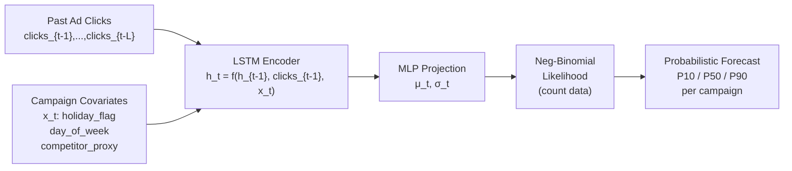
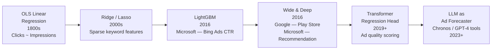
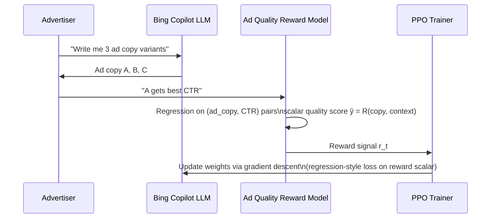
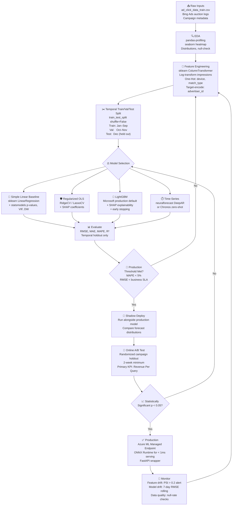
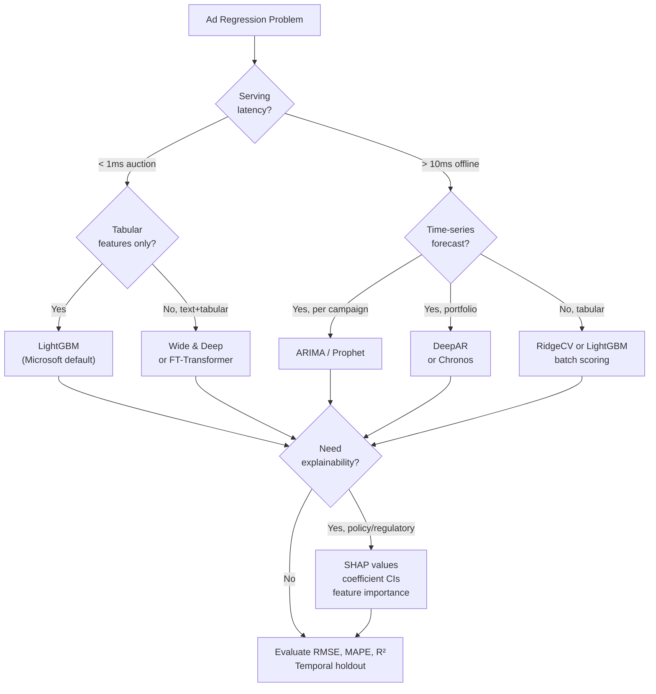

# 📊 Regression Techout — Part 3: Modern ML
### Time-Series Forecasting · LLM Era · End-to-End Pipeline · L6 Cheat Sheet
> **Part of:** [Index](../REGRESSION_TECHOUT.md) · [Part 1](REGRESSION_PART1_FOUNDATIONS.md) · [Part 2](REGRESSION_PART2_CLASSICAL_ML.md) · Part 3  
> **Audience:** L6+ AIML Engineer Preparation  
> **AdTech Context:** Ad budget forecasting, bid pacing, CTR prediction with LLMs, Bing Ads campaign automation.

```bash
pip install numpy pandas torch statsmodels lightgbm transformers \
            "chronos-forecasting[training]" neuralforecast matplotlib seaborn
```

---

## Table of Contents — Part 3

11. [Time-Series Regression & DeepAR](#11-time-series-regression--deepar)
12. [Regression in the LLM Era](#12-regression-in-the-llm-era)
13. [End-to-End AdTech Pipeline](#13-end-to-end-adtech-pipeline)
14. [L6+ Cheat Sheet](#14-microsoft-l6-cheat-sheet)

---

## 11. Time-Series Regression & DeepAR

### 🏫 School Intuition

Next week's **ad clicks** on Bing depend heavily on **last week's** clicks — a holiday campaign carries momentum; a competitor price drop this week affects your CTR next week.  
Standard regression ignores this time ordering. **Time-series regression** models the temporal dependency explicitly, letting last week's signal inform this week's prediction.

### 📐 Math Formulation

**Autoregressive Model AR($p$):**

$$
\text{clicks}_t = \beta_0 + \beta_1 \text{clicks}_{t-1} + \beta_2 \text{clicks}_{t-7} + \cdots + \beta_p \text{clicks}_{t-p} + \epsilon_t
$$

> In Bing Ads, $\text{clicks}_{t-7}$ (same day last week) is often the strongest predictor.

**ARIMA($p$, $d$, $q$):**
- $p$ = autoregressive lags (past click values)
- $d$ = differencing order (how many times to difference to make series stationary)
- $q$ = moving average order (past forecast errors)

$$
\Delta^d y_t = \sum_{i=1}^{p}\phi_i \Delta^d y_{t-i} + \epsilon_t + \sum_{j=1}^{q}\theta_j \epsilon_{t-j}
$$

**DeepAR** — probabilistic LSTM that learns across multiple ad campaign series:

$$
P(y_{t_0}, \ldots, y_{T} \mid y_1, \ldots, y_{t_0-1},\ \mathbf{x}_1, \ldots, \mathbf{x}_T) = \prod_{t=t_0}^{T} \ell\bigl(y_t \mid \mu_t(\mathbf{h}_t),\ \sigma_t(\mathbf{h}_t)\bigr)
$$

Where $\mathbf{h}_t$ is an LSTM hidden state over past clicks and campaign covariates (holiday flag, competitor spend proxy).

**Why probabilistic?** Ad budget allocation requires **P10/P90 intervals**:
- **P50** (median): expected clicks — used for campaign planning
- **P90** (95th percentile): upper bound — used for budget cap safety
- **P10** (5th percentile): lower bound — used for minimum guarantee to advertisers

### DeepAR Architecture



### 🧑‍💻 Python — Amazon Chronos (HuggingFace, zero-shot ad forecasting)

```python
# pip install "chronos-forecasting[training]"
# Chronos = T5 Transformer pre-trained on 100B+ time-series datapoints
# Zero-shot: no campaign-specific training needed

import torch
import pandas as pd
import numpy as np
import matplotlib.pyplot as plt
from chronos import ChronosPipeline

# Load Bing Ads daily click data (use your ad_click_data_train.csv in practice)
# Simulating 6 months of daily campaign clicks with weekly seasonality
np.random.seed(42)
n_days     = 180
day_index  = np.arange(n_days)
clicks_ts  = (
    500                                          # baseline
    + 50  * np.sin(2 * np.pi * day_index / 7)   # weekly seasonality (weekends dip)
    + 2.0 * day_index                            # upward trend (campaign growth)
    + np.random.normal(0, 30, n_days)            # noise
).clip(0).astype(int)

# Chronos expects a torch tensor
context = torch.tensor(clicks_ts, dtype=torch.float32)

# Load pre-trained Chronos T5 — zero-shot, no fine-tuning
pipeline = ChronosPipeline.from_pretrained(
    "amazon/chronos-t5-small",   # upgrade to chronos-t5-large for production
    device_map="cpu",
    torch_dtype=torch.float32,
)

# Forecast next 30 days (one month ahead) — probabilistic
forecast = pipeline.predict(context=context, prediction_length=30, num_samples=100)
# forecast shape: [1, num_samples, prediction_length]

low    = np.quantile(forecast[0].numpy(), 0.10, axis=0)   # P10 lower bound
median = np.quantile(forecast[0].numpy(), 0.50, axis=0)   # P50 central estimate
high   = np.quantile(forecast[0].numpy(), 0.90, axis=0)   # P90 upper bound

# Budget planning output
for day, (lo, med, hi) in enumerate(zip(low, median, high), 1):
    print(f"Day +{day:2d}: P10={int(lo):4d}  P50={int(med):4d}  P90={int(hi):4d} clicks")

# Visualise
plt.figure(figsize=(12, 4))
plt.plot(range(n_days), clicks_ts, label="Historical clicks", color="steelblue", lw=1)
x_future = range(n_days, n_days + 30)
plt.plot(x_future, median, label="P50 Forecast", color="tomato", lw=2)
plt.fill_between(x_future, low, high, alpha=0.25, color="tomato", label="P10–P90 Budget Range")
plt.axvline(n_days, color="gray", linestyle="--", label="Forecast start")
plt.xlabel("Day"); plt.ylabel("Ad Clicks")
plt.title("Bing Ads Campaign — Chronos T5 Zero-Shot Click Forecast")
plt.legend(); plt.tight_layout(); plt.savefig("chronos_ad_forecast.png", dpi=150)
```

### 🧑‍💻 Python — neuralforecast DeepAR (train on your own campaign portfolio)

```python
# pip install neuralforecast
# Use when: you have >50 ad campaigns and want a single global forecasting model
# Advantage over ARIMA: one model for all campaigns, handles cold-start new campaigns

import pandas as pd
import numpy as np
from neuralforecast import NeuralForecast
from neuralforecast.models import DeepAR
from neuralforecast.losses.pytorch import MQLoss

np.random.seed(42)

# Simulate portfolio of 10 ad campaigns, each with 180 days of click history
records = []
for campaign_id in range(1, 11):
    n = 180
    base = np.random.randint(200, 800)
    clicks = (
        base
        + 30 * np.sin(2 * np.pi * np.arange(n) / 7)   # weekly seasonality
        + np.random.normal(0, 20, n)
    ).clip(0)
    for day, c in enumerate(clicks):
        records.append({
            "unique_id": f"campaign_{campaign_id:02d}",   # required by neuralforecast
            "ds":        pd.Timestamp("2025-01-01") + pd.Timedelta(days=day),
            "y":         max(0, round(c)),
        })

df    = pd.DataFrame(records)
train = df[df["ds"] < "2025-06-01"]   # train on Jan–May
test  = df[df["ds"] >= "2025-06-01"]  # evaluate on June (30 days ahead)

model = DeepAR(
    h                = 30,           # forecast horizon: 30 days ahead
    input_size       = 60,           # look-back: 60 days of click history
    lstm_n_layers    = 2,
    lstm_hidden_size = 64,
    loss             = MQLoss(quantiles=[0.1, 0.5, 0.9]),  # P10/P50/P90
    max_steps        = 300,
    scaler_type      = "standard",   # normalise each campaign independently
    learning_rate    = 5e-4,
)

nf    = NeuralForecast(models=[model], freq="D")
nf.fit(df=train)
preds = nf.predict()

# preds columns: unique_id, ds, DeepAR-q-0.1, DeepAR-q-0.5, DeepAR-q-0.9
print(preds.head(10))

# Compute MAPE on median forecast vs actuals
merged = preds.merge(test[["unique_id","ds","y"]], on=["unique_id","ds"])
merged["mape"] = abs(merged["y"] - merged["DeepAR-q-0.5"]) / (merged["y"] + 1e-9) * 100
print(f"\nPortfolio Median MAPE: {merged['mape'].mean():.2f}%")
print(f"Campaigns with MAPE < 10%: {(merged.groupby('unique_id')['mape'].mean() < 10).sum()}/10")
```

### 💼 L6+ Interview Angle

> **"Why use DeepAR over ARIMA for Bing Ads campaign click forecasting?"**  
>
> | Dimension | ARIMA | DeepAR |
> |-----------|-------|--------|
> | Scale | One model per campaign — fails at millions | One global model — scales to all campaigns |
> | Cold-start | Needs 2+ years of history | Transfers knowledge from similar campaigns |
> | Covariates | Limited external signal ingestion | Holiday flags, competitor bid proxies natively |
> | Forecast type | Point estimate only | Full distribution: P10/P50/P90 |
> | Stationarity | Requires differencing, data prep | LSTM learns trend/seasonality automatically |
>
> - At Microsoft: **Azure Machine Learning + DeepAR / Chronos** is the production standard for large-scale ad spend forecasting, powering the Bing Ads budget recommendation feature.

### ⚠️ Common Pitfalls

- [ ] **Shuffling time-series** before train/test split — always use temporal split (`df[df['ds'] < cutoff]`)
- [ ] Using Chronos zero-shot on very domain-specific ad data (e.g., B2B SaaS weekly enterprise campaigns) — consider fine-tuning on your portfolio
- [ ] Not including the **day-of-week** covariate — DeepAR's strongest signal for ad click patterns
- [ ] Reporting only P50 to advertisers — always show P10–P90 range for budget safety

---

## 12. Regression in the LLM Era

### The Spectrum: Classical → Modern



### 📐 LLM as an Ad Regression Model

**In-context regression** — GPT-4 as a zero-shot ad click forecaster:

```
System: You are a Bing Ads click forecasting model.
User:
  impressions=10000, bid=1.20, quality=7 → clicks=85
  impressions=14000, bid=1.50, quality=8 → clicks=102
  impressions=16000, bid=1.80, quality=9 → clicks=110
  impressions=13000, bid=1.40, quality=8 → clicks=?
```

The LLM generates `≈ 98` — pattern matching equivalent to linear interpolation in the feature space.

Formally, the LLM computes a **posterior predictive**:

$$
P(y_{new} \mid \text{prompt}) = P(\text{clicks}_{new} \mid x_{new},\ \{(x_i, \text{clicks}_i)\}_{i=1}^k)
$$

This is equivalent to **Bayesian regression** with a learned implicit prior over functions — essentially a Gaussian Process with a neural kernel!

### Regression → RLHF → Ad Quality Loop



**The Reward Model IS regression:**

$$
\mathcal{L}_{RM} = -\log \sigma\bigl(r_\theta(x, y_{chosen}) - r_\theta(x, y_{rejected})\bigr)
$$

$r_\theta(x, y)$ = scalar regression score output, $y_{chosen}$ = higher-CTR ad, $y_{rejected}$ = lower-CTR ad.

### Tabular Regression Spectrum for AdTech

| Approach | Best For | Latency | Microsoft Product |
|----------|---------|---------|------------------|
| **LightGBM** | Bing Ads CTR, tabular features | < 1ms | Azure AutoML default |
| **Wide & Deep** | Cross-feature ad interactions | 2–5ms | Recommendation systems |
| **FT-Transformer** | Feature interactions, mixed types | 10ms | Azure ML tabular DNN |
| **Chronos / DeepAR** | Ad budget time-series forecasting | batch | Bing budget planner |
| **LLM + Tools** | Ad copy quality scoring, cold-start | 100ms–1s | Bing Copilot creative |

### 🧑‍💻 Python — HuggingFace Reward Model for Ad Copy Quality Scoring

```python
# Ad copy quality scoring = regression on text
# A BERT encoder + linear regression head predicts a scalar CTR quality score
import torch
import torch.nn as nn
from transformers import AutoModel, AutoTokenizer

class AdQualityRewardModel(nn.Module):
    """
    Scores ad copy quality for CTR potential.
    Bing Copilot uses this pattern to rank LLM-generated ad variants.
    Architecture: BERT encoder → [CLS] pooling → linear regression head → scalar score
    """
    def __init__(self, backbone="distilbert-base-uncased"):
        super().__init__()
        self.encoder    = AutoModel.from_pretrained(backbone)
        hidden_size     = self.encoder.config.hidden_size  # 768 for distilbert
        self.quality_head = nn.Sequential(
            nn.Linear(hidden_size, 256),
            nn.ReLU(),
            nn.Dropout(0.1),
            nn.Linear(256, 1),              # scalar regression output: quality score
        )

    def forward(self, input_ids, attention_mask):
        enc    = self.encoder(input_ids=input_ids, attention_mask=attention_mask)
        cls    = enc.last_hidden_state[:, 0, :]   # [CLS] embedding
        score  = self.quality_head(cls)            # regression: quality ∈ ℝ
        return score.squeeze(-1)

tokenizer = AutoTokenizer.from_pretrained("distilbert-base-uncased")
model     = AdQualityRewardModel()

# Bradley-Terry preference loss: preferred ad should score higher
def ad_preference_loss(score_chosen, score_rejected):
    """
    L = -log σ(score_chosen - score_rejected)
    Gradient pushes chosen ad score UP and rejected score DOWN.
    Pure regression gradient signal — same math as OLS gradient, different loss.
    """
    return -torch.log(torch.sigmoid(score_chosen - score_rejected)).mean()

# Simulated ad copy pairs (chosen = higher CTR, rejected = lower CTR)
ads_chosen   = ["Buy Premium Running Shoes — Free Shipping Today!",
                "50% Off Nike Air Max — Limited Time Offer"]
ads_rejected = ["Shoes for sale click here",
                "We have good shoes at ok prices"]

enc_chosen   = tokenizer(ads_chosen,   return_tensors="pt", padding=True, truncation=True, max_length=64)
enc_rejected = tokenizer(ads_rejected, return_tensors="pt", padding=True, truncation=True, max_length=64)

scores_chosen   = model(**enc_chosen)
scores_rejected = model(**enc_rejected)
loss = ad_preference_loss(scores_chosen, scores_rejected)

print(f"Chosen ad quality scores:   {scores_chosen.tolist()}")
print(f"Rejected ad quality scores: {scores_rejected.tolist()}")
print(f"Preference loss (lower=better): {loss.item():.4f}")
```

### 🧑‍💻 Python — LightGBM for Bing Ads CTR (Microsoft production standard)

```python
# LightGBM is developed by Microsoft Research
# Production workhorse for Bing Ads CTR regression / ranking
import lightgbm as lgb
import numpy as np
import pandas as pd
from sklearn.model_selection import train_test_split
from sklearn.metrics import mean_squared_error, r2_score
import matplotlib.pyplot as plt

np.random.seed(42)
n = 10000

# Simulate realistic Bing Ads auction log features
df = pd.DataFrame({
    "impressions":      np.random.randint(100, 100000, n),
    "bid_price":        np.random.uniform(0.1, 5.0, n),
    "quality_score":    np.random.randint(1, 11, n),
    "ad_relevance":     np.random.uniform(0, 1, n),
    "landing_page_exp": np.random.uniform(0, 1, n),
    "device_mobile":    np.random.randint(0, 2, n),      # one-hot
    "match_type_exact": np.random.randint(0, 2, n),     # one-hot
    "day_of_week":      np.random.randint(0, 7, n),
    "hour_of_day":      np.random.randint(0, 24, n),
})

# Clicks: nonlinear interaction between quality, bid, and ad relevance
df["clicks"] = (
    0.0015 * df["impressions"]
    * (1 + df["quality_score"] / 10)
    * (1 + df["bid_price"] / 3)
    * (1 + df["ad_relevance"])
    * (1 - 0.15 * df["device_mobile"])  # mobile has lower CVR
    + np.random.normal(0, 5, n)
).clip(0).round()

X = df.drop(columns=["clicks"])
y = df["clicks"].values

X_tr, X_val, y_tr, y_val = train_test_split(X, y, test_size=0.2, shuffle=False)

dtrain = lgb.Dataset(X_tr, label=y_tr)
dval   = lgb.Dataset(X_val, label=y_val, reference=dtrain)

params = {
    "objective":         "regression",      # MSE loss — predict click volume
    "metric":            "rmse",
    "learning_rate":     0.05,
    "num_leaves":        127,               # controls tree complexity
    "feature_fraction":  0.8,              # subsample features per tree
    "bagging_fraction":  0.8,              # subsample rows per tree
    "bagging_freq":      5,
    "lambda_l1":         0.1,              # Lasso on leaf weights
    "lambda_l2":         1.0,              # Ridge on leaf weights
    "min_child_samples": 20,
    "verbosity":         -1,
}

bst = lgb.train(
    params, dtrain,
    num_boost_round = 1000,
    valid_sets      = [dval],
    callbacks       = [lgb.early_stopping(50, verbose=False),
                       lgb.log_evaluation(200)],
)

preds  = bst.predict(X_val)
rmse   = mean_squared_error(y_val, preds, squared=False)
r2     = r2_score(y_val, preds)
mape   = np.mean(np.abs(y_val - preds) / (y_val + 1)) * 100

print(f"Bing Ads Click Forecast (LightGBM)")
print(f"  RMSE = {rmse:.2f} clicks")
print(f"  R²   = {r2:.4f}")
print(f"  MAPE = {mape:.2f}%")
print(f"  Best iteration: {bst.best_iteration}")

# SHAP feature importance — required for Bing Ads model explainability / policy compliance
import shap
explainer  = shap.TreeExplainer(bst)
shap_vals  = explainer.shap_values(X_val[:500])
shap.summary_plot(shap_vals, X_val[:500], show=False)
plt.title("Bing Ads CTR Model — SHAP Feature Importance")
plt.tight_layout(); plt.savefig("shap_adclick.png", dpi=150)
```

### 💼 L6+ Interview Angle

> **"When would you replace LightGBM with an LLM for ad click forecasting?"**  
>
> | Scenario | Use LightGBM | Use LLM |
> |----------|-------------|---------|
> | Latency | ✅ < 1ms auction serving | ❌ 100ms–1s too slow |
> | Interpretability | ✅ SHAP values, required for policy | ❌ opaque by default |
> | Cold-start | ❌ needs campaign history | ✅ zero-shot from pre-training |
> | Text features | ❌ bag-of-words at best | ✅ native — ad copy, keywords |
> | Multi-modal | ❌ tabular only | ✅ image + text + tabular |
> | Regulatory | ✅ auditable | ⚠️ needs extra explainability work |
>
> **Hybrid (Microsoft Copilot for Bing Ads approach):**  
> LLM → generates ad copy variants → Reward Model (BERT regression) → ranks by predicted CTR → LightGBM → final bid adjustment → auction.

---

## 13. End-to-End AdTech Pipeline



### 🧑‍💻 Python — Full Pipeline in Code

```python
import numpy as np
import pandas as pd
import lightgbm as lgb
from sklearn.pipeline import Pipeline
from sklearn.compose import ColumnTransformer
from sklearn.preprocessing import StandardScaler, OneHotEncoder, FunctionTransformer
from sklearn.linear_model import RidgeCV
from sklearn.model_selection import train_test_split
from sklearn.metrics import mean_squared_error, r2_score, mean_absolute_percentage_error
import warnings
warnings.filterwarnings("ignore")

# ── 1. Load / simulate ad data ──
np.random.seed(42)
n = 2000
df = pd.DataFrame({
    "impressions":      np.random.randint(1000, 100000, n),
    "bid_price":        np.random.uniform(0.1, 4.0, n),
    "quality_score":    np.random.randint(1, 11, n),
    "ad_relevance":     np.random.uniform(0, 1, n),
    "device_type":      np.random.choice(["mobile","desktop","tablet"], n),
    "match_type":       np.random.choice(["exact","broad","phrase"], n),
    "day_of_week":      np.random.choice(["Mon","Tue","Wed","Thu","Fri","Sat","Sun"], n),
})
df["clicks"] = (
    0.002 * df["impressions"] * (1 + df["quality_score"]/10) * (1 + df["bid_price"]/3)
    * (1 + df["ad_relevance"])
    + np.random.normal(0, 15, n)
).clip(0).round()

X, y = df.drop(columns=["clicks"]), df["clicks"].values

# ── 2. Temporal split ──
X_tr, X_te, y_tr, y_te = train_test_split(X, y, test_size=0.2, shuffle=False)

# ── 3. Feature preprocessing ──
numeric_cols = ["bid_price", "quality_score", "ad_relevance"]
log_cols     = ["impressions"]
cat_cols     = ["device_type", "match_type", "day_of_week"]

preprocessor = ColumnTransformer([
    ("num",  StandardScaler(),                                    numeric_cols),
    ("log",  Pipeline([("log", FunctionTransformer(np.log1p)),
                       ("sc",  StandardScaler())]),               log_cols),
    ("cat",  OneHotEncoder(drop="first", sparse_output=False),   cat_cols),
])

# ── 4a. Baseline: Regularized Linear ──
linear_pipe = Pipeline([("prep", preprocessor), ("model", RidgeCV())])
linear_pipe.fit(X_tr, y_tr)
preds_linear = linear_pipe.predict(X_te)

# ── 4b. Production: LightGBM ──
X_tr_p = preprocessor.fit_transform(X_tr, y_tr)
X_te_p = preprocessor.transform(X_te)

bst = lgb.train(
    {"objective": "regression", "metric": "rmse", "learning_rate": 0.05,
     "num_leaves": 63, "verbosity": -1},
    lgb.Dataset(X_tr_p, label=y_tr),
    num_boost_round=500,
    valid_sets=[lgb.Dataset(X_te_p, label=y_te)],
    callbacks=[lgb.early_stopping(30, verbose=False)],
)
preds_lgb = bst.predict(X_te_p)

# ── 5. Evaluate ──
def report(name, y_true, y_pred):
    rmse = mean_squared_error(y_true, y_pred, squared=False)
    r2   = r2_score(y_true, y_pred)
    mape = mean_absolute_percentage_error(y_true, y_pred) * 100
    print(f"{name:20s}  RMSE={rmse:7.2f}  R²={r2:.4f}  MAPE={mape:.2f}%")

print("=== Ad Click Forecast — Model Comparison ===")
report("Ridge (baseline)",  y_te, preds_linear)
report("LightGBM (prod)",   y_te, preds_lgb)

# ── 6. Drift monitoring stub ──
def psi(expected, actual, bins=10):
    """Population Stability Index — alert if PSI > 0.2 (major distribution shift)"""
    exp_pct = np.histogram(expected, bins=bins, density=True)[0] + 1e-10
    act_pct = np.histogram(actual,   bins=bins, density=True)[0] + 1e-10
    return np.sum((act_pct - exp_pct) * np.log(act_pct / exp_pct))

psi_val = psi(X_tr["impressions"].values, X_te["impressions"].values)
print(f"\nPSI (impressions drift): {psi_val:.4f}  "
      f"{'⚠️ DRIFT ALERT — retrain model' if psi_val > 0.2 else '✅ Stable'}")
```

---

## 14. L6+ Cheat Sheet

### Core Equations to Know Cold

| Concept | Formula | AdTech Application |
|---------|---------|-------------------|
| OLS estimator | $\boldsymbol{\beta}^* = (\mathbf{X}^T\mathbf{X})^{-1}\mathbf{X}^T\mathbf{y}$ | Small campaign feature sets |
| Ridge | $\boldsymbol{\beta}^* = (\mathbf{X}^T\mathbf{X} + \lambda\mathbf{I})^{-1}\mathbf{X}^T\mathbf{y}$ | Correlated ad signals (impressions ↔ spend) |
| GD update (vectorized) | $\boldsymbol{\beta} \leftarrow \boldsymbol{\beta} - \frac{\alpha}{n}\mathbf{X}^T(\mathbf{X}\boldsymbol{\beta} - \mathbf{y})$ | Online learning on auction stream |
| Bias-Variance | $\text{MSE} = \text{Bias}^2 + \text{Variance} + \sigma^2$ | Model complexity selection |
| R-squared | $R^2 = 1 - SS_{res}/SS_{tot}$ | % click variance explained |
| Adam update | $\theta \leftarrow \theta - \alpha\hat{m}/(\sqrt{\hat{v}}+\epsilon) - \alpha\lambda\theta$ | CTR deep model training |
| DeepAR likelihood | $\prod_{t} \ell(y_t \mid \mu_t, \sigma_t)$ | Ad budget P10/P50/P90 |
| LoRA delta | $\Delta W = AB,\; r \ll d$ | Fine-tuning ad quality LLM |
| RLHF reward loss | $\mathcal{L} = -\log\sigma(r_{chosen} - r_{rejected})$ | Ad copy quality ranking |
| PSI drift alert | $\text{PSI} = \sum (P_{act} - P_{exp})\ln\frac{P_{act}}{P_{exp}} > 0.2$ | Campaign distribution shift |

### AdTech Model Selection Tree



### STAR-ML Interview Response Framework

For every regression question at L6+:

| Letter | What to say | AdTech Example |
|--------|------------|----------------|
| **S**ituation | State the real-world problem | "Bing Ads needs to forecast monthly click volume for 5M campaigns for budget planning" |
| **T**echnique | Name exact algorithm + why | "DeepAR with Neg-Binomial loss — handles count data, learns across campaigns, gives P10/P90" |
| **A**ssumptions | What are you assuming? How verified? | "Temporal stationarity per campaign after differencing — verified with ADF test" |
| **R**obustness | Regularization + outlier handling | "LightGBM with lambda_l1=0.1, lambda_l2=1.0 + Huber loss for Black Friday outliers" |
| **M**etrics | Offline + online + alignment | "Offline: MAPE < 5%. Online: Revenue Per Query lift > 2% at p < 0.05 in 2-week A/B test" |
| **L**imitations | When does it break? What's fallback? | "New advertiser cold-start → use Chronos zero-shot; market shock → immediate retrain trigger" |

### Top 10 L6 Interview Questions + One-Line Answers

| # | Question | Answer |
|---|----------|--------|
| 1 | Normal Equation complexity? | $O(p^3)$ — unusable for $p > 10^5$ (Bing Ads keyword IDs) |
| 2 | Why Ridge over Lasso when features correlated? | Lasso arbitrarily picks one; Ridge keeps all with stable shrinkage |
| 3 | Why log-transform impressions? | Right-skewed (100 to 10M) → normalises gradient scale |
| 4 | How to detect temporal leakage? | Check if shuffling train/test improves metrics vs temporal split |
| 5 | MAPE limitation? | Undefined when $y_i = 0$ (zero-click long-tail keywords) — use sMAPE |
| 6 | DW test result DW=1.1? | Positive autocorrelation — add lag features $y_{t-1}, y_{t-7}$ |
| 7 | VIF > 10 for `impressions` and `spend`? | Perfect multicollinearity — drop `spend` (derived from impressions × bid) |
| 8 | LightGBM vs neural net for 1ms auction? | LightGBM — neural net inference too slow; LightGBM leaf prediction in microseconds |
| 9 | How justify $\lambda$ choice for Ridge? | Nested CV (inner CV for $\lambda$, outer CV for generalisation estimate) — never touch test set |
| 10 | Offline MAPE improved but online A/B flat? | Metric misalignment — offline MAPE on clicks ≠ online Revenue Per Query. Always A/B. |

---

## References

| Resource | Link |
|----------|------|
| scikit-learn Linear Models | https://scikit-learn.org/stable/modules/linear_model.html |
| statsmodels OLS | https://www.statsmodels.org/stable/regression.html |
| PyTorch nn.Linear | https://pytorch.org/docs/stable/generated/torch.nn.Linear.html |
| LightGBM (Microsoft Research) | https://lightgbm.readthedocs.io |
| Amazon Chronos (HuggingFace) | https://huggingface.co/amazon/chronos-t5-small |
| Chronos Paper (2024) | https://arxiv.org/abs/2403.07815 |
| neuralforecast DeepAR | https://nixtlaverse.nixtla.io/neuralforecast/models.deepar.html |
| DeepAR Paper | https://arxiv.org/abs/1704.04110 |
| HuggingFace Transformers | https://huggingface.co/docs/transformers |
| Azure AutoML Docs | https://learn.microsoft.com/en-us/azure/machine-learning/concept-automated-ml |
| LoRA Paper | https://arxiv.org/abs/2106.09685 |
| Illustrated RLHF | https://huggingface.co/blog/rlhf |
| ML Regression (Coursera) | https://www.coursera.org/learn/ml-regression |
| Wide & Deep Paper | https://arxiv.org/abs/1606.07792 |

---

## Navigation

| | |
|---|---|
| ← Previous | [Part 2: Classical ML — Multiple Regression, Regularization, Metrics](REGRESSION_PART2_CLASSICAL_ML.md) |
| **You are here** | **Part 3: Modern ML (§11–14)** |
| → Next | — |
| 🗺 Index | [REGRESSION_TECHOUT.md](../REGRESSION_TECHOUT.md) |

